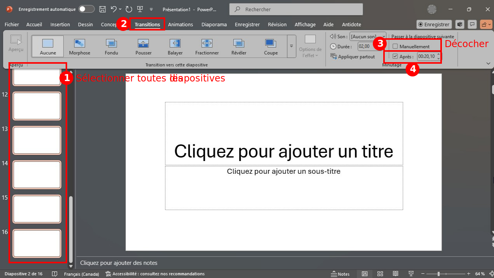
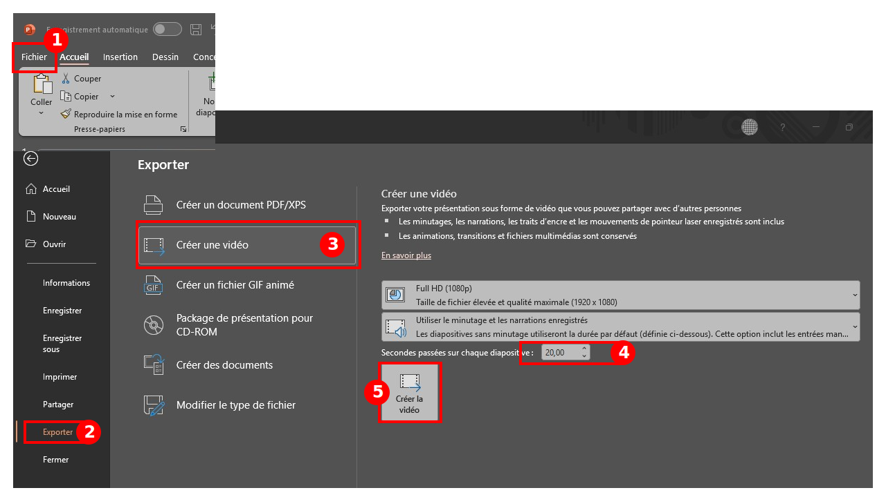

# Pecha Kucha

Le format Pecha Kucha est une façon très particulière de faire une présentation orale. Il est couramment utilisé pour des : 
- Événements créatifs ou artistiques (design, art, multimédia). 
- Présentations d’équipe rapides (pitchs de projet, brainstorming). 
- Conférences qui veulent garder un rythme vivant. 

Le principe : 
- 15 diapositives PowerPoint EXACTEMENT 
- 20 secondes de durée chacune EXACTEMENT 
- Les diapositives avancent automatiquement 
- Donc la présentation dure EXACTEMENT 5 minutes au total  
- Rythme rapide : pas le temps de s’étendre, chaque idée doit être claire et concise. 
- Visuel : les diapositives sont surtout des images, pas des longs textes. 
- Éviter d'inclure des vidéos, de l'audio et surtout des liens externes 

## Exemples de présentations Pecha Kucha

- [Intellect Begets Art](https://www.youtube.com/watch?v=HmhhfbIsTSk)
- [Games as Interactive Art](https://www.youtube.com/watch?v=wb16067ptX8)
- [Video Games as Art (PechaKucha)](https://www.youtube.com/watch?v=Y-vc_2o8IR4)

## Comment automatiser le défilement d'une présentation PowerPoint

Les 2 méthodes suivantes exigent l'utilisation de l'application de bureau (et non la version en ligne de PowerPoint).

### Avec des transitions

### En exportant une vidéo

