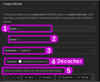

# Nouveau projet PlatformIO


## Préalable(s)

- [Installer PlatformIO dans Visual Studio Code](/platformio/installation/).

## Initialiser un nouveau projet

Cliquer sur le bouton `Create New Project` dans Visual Studio Code.


Par la suite, remplir le `Project Wizard` :
- Pour le nom pas d'espaces ou de caractères spéciaux sauf `_` ou `-`.
- Choisir le bon modèle de plaquette.
- Décocher l'emplacement par défaut.
- Choisir un dossier de sauvegarde - un nouveau dossier y sera créé pour le projet.




## Fichiers de configuration et de code


## Compiler et téléverser


## Le code minimal

```cpp
// Le code minimal

#include <Arduino.h> 

void setup() {
  
}

void loop() {
 
}
```