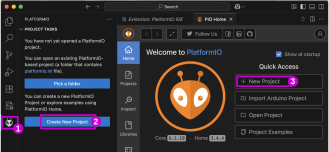
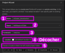
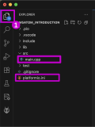
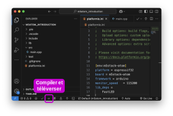

# Nouveau projet PlatformIO

## Initaliser un nouveau projet





## Fichiers de configuration et de code



## Le code minimal

```cpp
// Le code minimal

#include <Arduino.h> 

void setup() {
  
}

void loop() {
 
}
```

## Compiler et téléverser

