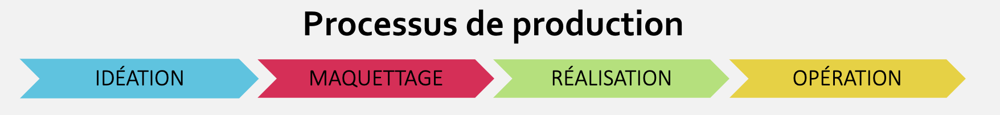

# Étapes de production 

## **Idéation**  
   **Objectif : Explorer et définir la vision du projet.**  
   - Analyse des besoins et du contexte.
   - Détermination du public cible. 
   - Recherche, inspiration, brainstorming, choix et développement d'une idée. 
   - Définition des objectifs et de l’intention d’expérience. 

## **Maquette**  
   **Objectif : Donner forme aux idées pour les valider.**  
   - Création de maquettes visuelles ou fonctionnelles.  
   - Scénarisation des parcours utilisateurs.  
   - Tests initiaux pour recueillir des retours.  
   - Prototypes des médias et des processus.
   - Budget.

## **Réalisation**  
   **Objectif : Produire la version finale du projet.**  
   - Développement, fabrication et intégration.   
   - Contrôle de la qualité, respect des contraintes et des intentions.  
   - Préparation au lancement.

## **Opération**  
   **Objectif : Mettre en service et faire vivre le projet.** 
   - Déploiement ou mise en ligne.  
   - Communication, accompagnement des utilisateurs.  
   - Suivi en conditions réelles.  
   - Maintenance, évolutions, amélioration continue.
