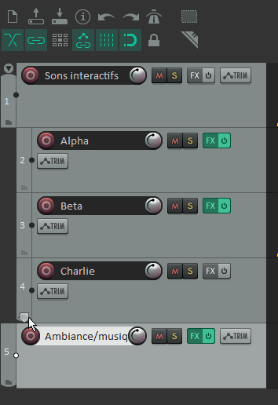

# Compression *sidechain* dans Reaper

La compression *sidechain* permet à une piste ou une groupe de piste de contrôler le volume d'une piste ou d'un groupe de piste. Voici un exemple : [Understanding Compression: Sidechaining in REAPER - YouTube](https://www.youtube.com/watch?v=JEKKGup1J68)

## Démonstration

Dans la démonstration qui suit, on veut que le volume des sons interactifs baisent automatiquement le volume de la piste d'ambiance/musique.

### Grouper les pistes qui vont contrôler le volume de l'ambiance ou de la musique

### Effectuer le routage du gorupe de sons interactifs vers l'entrée auxiliaire du compresseur de l'ambiance/musique

