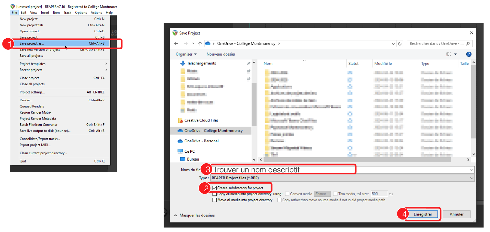
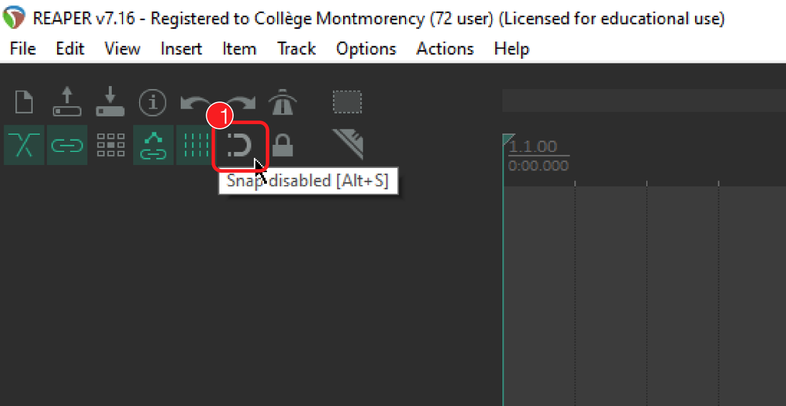
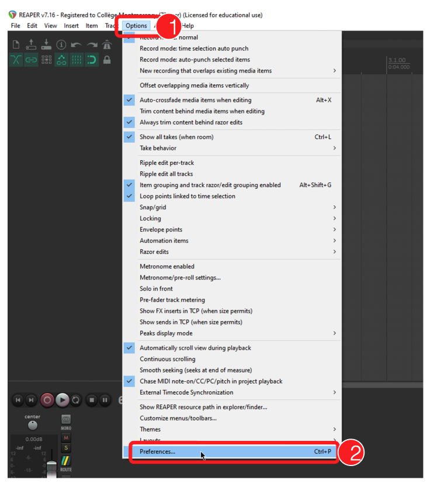
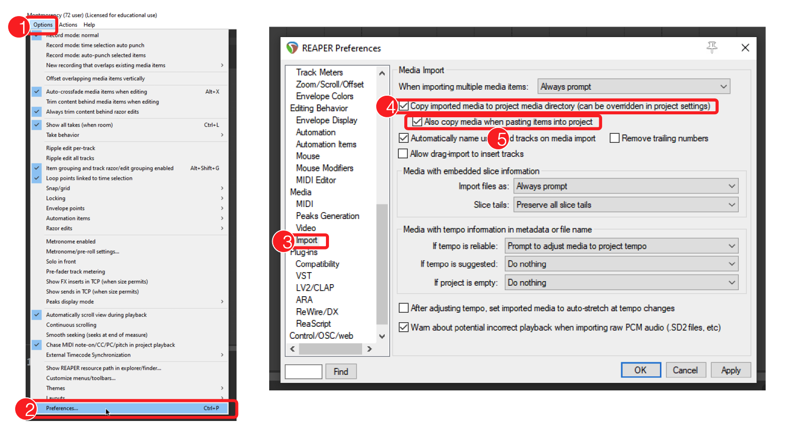
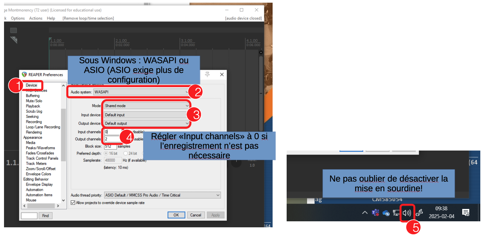
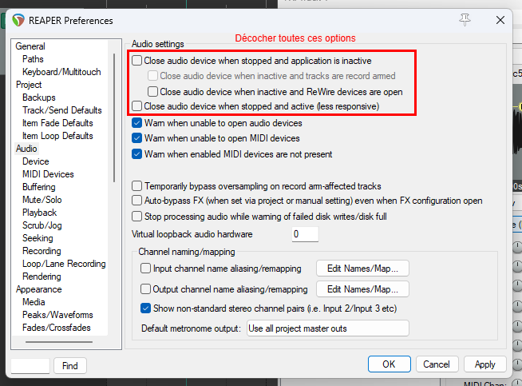
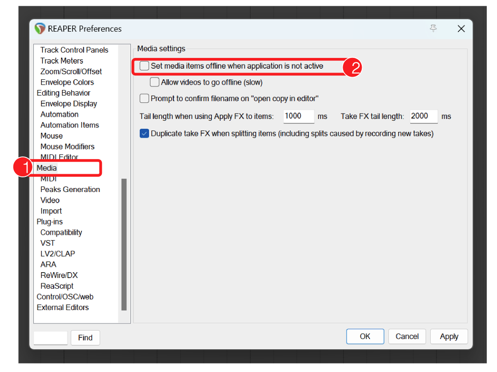

# Reaper : Configuration 

## Partir un nouveau projet

## Paramètres du projet

## Désactiver le "Snap"

## Préférences

### Importation des médias

### Matériel Audio

### Fermeture automatique du matériel audio

### Désactiver la mise «Offline» des fichiers

