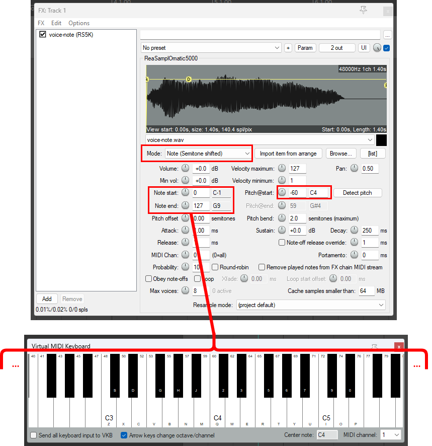
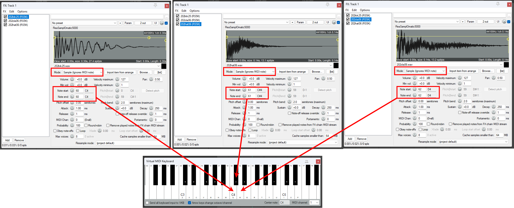
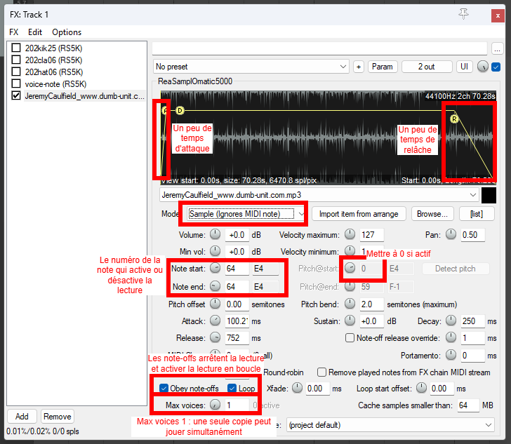

# Reaper : Échantillonneur

La lecture d'échantillons (_samples_ en anglais) se fait avec un _échantillonneur_ (_sampler_ en anglais). Reaper est distribué avec l'_échantillonneur_ **ReaSamplOmatic5000** qui peut être ajouté à une piste et être contrôlé par MIDI ou par OSC (avec  le Virtual Midi Keyboard).

**ReaSamplOmatic5000** peut être utilisé en 3 modes :
- Mode hauteur (_pitched_) : jouer un échantillon comme un synthétiseur ou un piano virtuel
- Mode multiple : jouer plusieurs échantillons différents
- Mode boucle (_loop_) : activer et désactiver la lecture d'un échantillon lu en boucle

> [!NOTE]
> Peu importe le mode utilisé, il ne faut oublier de copier les échantillons dans votre dossier de projet Reaper.
> Il faut ensuite glisser l'échantillon dans ReaSamplOmatic5000.

## ReaSamplOmatic5000 mode hauteur (_pitched_)

- Ce mode permet de jouer un échantillon comme un synthétiseur ou un piano virtuel. 
- La valeur de la note MIDI change la hauteur du son.
- Ce mode nécessite **un seul** ReaSamplOmatic5000.

## ReaSamplOmatic5000 mode multiple

- Ce mode permet de jouer plusieurs échantillons différents.
- La valeur de la note MIDI sélectionne l'échantillon.
- Ce mode nécessite **un** ReaSamplOmatic5000 **pour chaque échantillon**!

   

## ReaSamplOmatic5000 mode boucle (_loop_)

- Ce mode permet d'activer et désactiver la lecture d'un échantillon lu en boucle.
- Un message MIDI Note avec une **vélocité entre 1 et 127** active la lecture.
- Un message MIDI Note avec une **vélocité de 0** désactive la lecture.

   