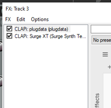

# Contrôler un paramètre d'effet ou d'instrument par OSC avec plugdata

## Préalable(s)

* Installer plugdata

## S'assurer que plugdata est dans la chaine avant l'instrument ou l'effet

## Optionnellement, lier un ou des paramètre à des MIDI CC  

* [Lier un MIDI CC à un paramètre d'un effet ou d'un instrument](/reaper/midi/cc/fx/)

## Convertir les messages OSC en MIDI (CC et notes) dans plugdata

* S'inspirer du patcher qui démontre comment [convertir les messages OSC en MIDI (notes et CC)](/pd/osc/midi/)
