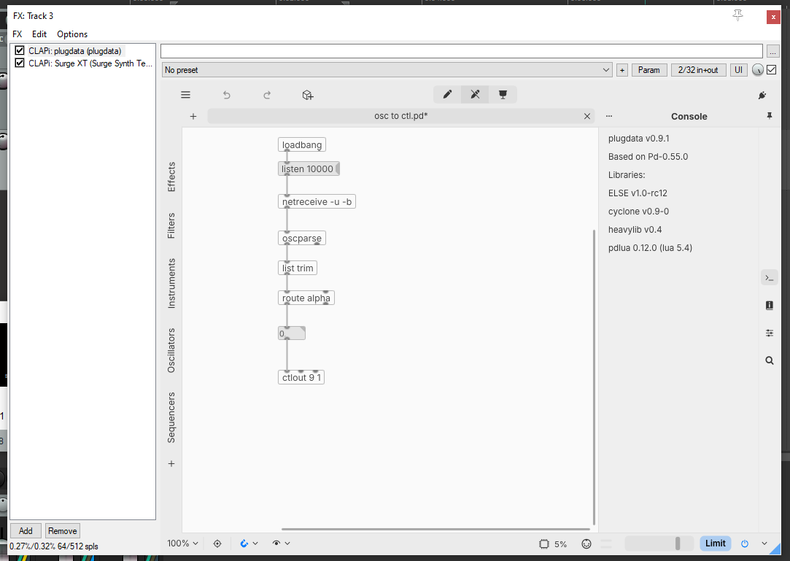

# Contrôler un paramètre d'effet ou d'instrument par OSC avec plugdata

## Préalable(s)

* Installer plugdata
* [Assigner un MIDI CC à un paramètre d'un effet ou d'un instrument](/reaper/midi/cc/fx/README.md)

## S'assurer que plugdata est dans la chaine avant l'instrument ou l'effet

## Convertir le message OSC en MIDI CC

