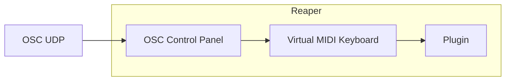
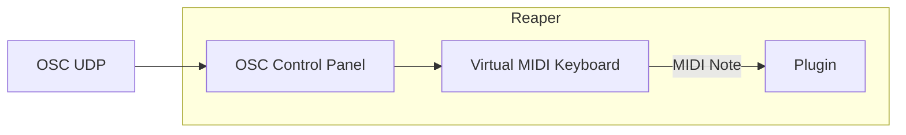
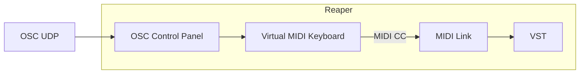

# Reaper: OSC et plugins

## Préalable(s)

- [Activation de l'OSC dans Reaper](/reaper/osc/activation/)
- Utilisation du [Virtual MIDI Keyboard](/reaper/virtual_midi_keyboard/)
- Configuration [MIDI d'un plugin](/reaper/midi/plugin/)

### Pour contrôler un plugin par OSC, il faut passer par le Virtual MIDI Keyboard




#### Message OSC pour envoyer un MIDI Note au Virtual MIDI Keyboard



Si le [default_pattern](/reaper/osc/default_pattern/) est utilisé, voici le format du message OSC :
```
/vkb_midi/@/note/# i
```
* `@` : canal 0-15 (int)
* `#` : numéro de la note 0-127 (int)
* `i` : vélocité 0-127 (int)

#### Message OSC pour envoyer un MIDI CC au Virtual MIDI Keyboard



Si le [default_pattern](/reaper/osc/default_pattern/) est utilisé, voici le format du message OSC :
```
/vkb_midi/@/cc/# i
```
* `@` : canal 0-15 (int)
* `#` : numéro du CC 0-127 (int)
* `i` : valeur 0-127 (int)


