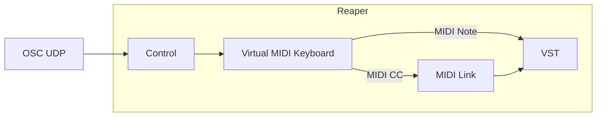
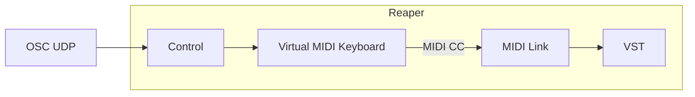

# Contrôle d'un effet ou instrument par OSC avec le Virtual Keyboard (VKB)

## Préalable(s)

- [OSC dans Reaper](/reaper/osc/)
- [Virtual Keyboard (VKB)](/reaper/midi/vkb/)
- [Assigner un MIDI CC à un paramètre d'un VST](/reaper/midi/cc/vst)

### Contrôler le Virtual Keyboard (VKB) par OSC



#### Message OSC pour envoyer un MIDI Note au Virtual MIDI Keyboard

```
/vkb_midi/@/note/# i
```
* `@` : canal 0-15 (int)
* `#` : numéro de la note 0-127 (int)
* `i` : vélocité 0-127 (int)

#### Message OSC pour envoyer un MIDI CC au Virtual MIDI Keyboard




```
/vkb_midi/@/cc/# i
```
* `@` : canal 0-15 (int)
* `#` : numéro du CC 0-127 (int)
* `i` : valeur 0-127 (int)


