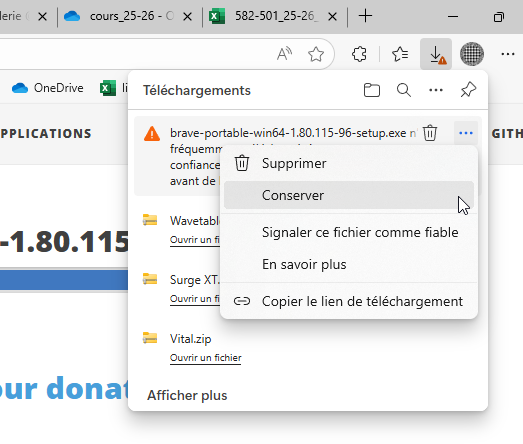
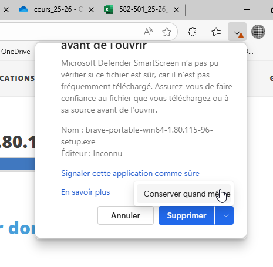
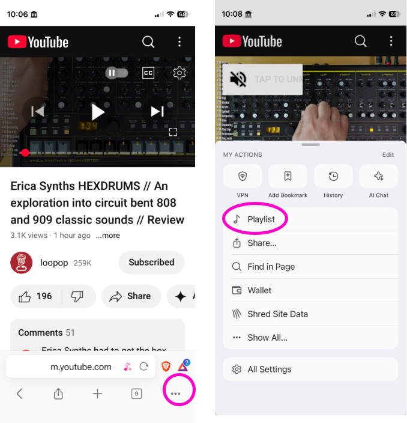

# Brave

Brave est disponible pour Windows, macOS, iOS et Android. Ses fonctionnalités particulières :
- Bloqueur de publicité intégré
- Sur cellulaire : Permet de télécharger des vidéos et de les lire l'écran éteint

## Windows

De préférence, installer la [version officielle](https://brave.com/), mais en absence de droits administratifs, utiliser la version [portable](https://portapps.io/app/brave-portable/#download). 

Il se peut que le navigateur actuel refuse de télécharger ou d'exécuter la version portable de Brave. Il est possible de forcer son utilisation :

## Playlist

