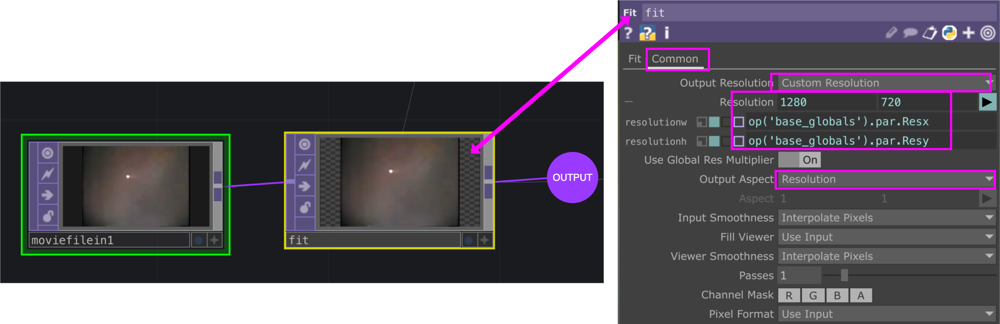

# TouchDesigner : Aspect

Pour préserver l'aspect d'une source, il est nécessaire d'utiliser un _CHOP FIT_. Utiliser des [globales](../globales/) pour avoir une résolution constante pour tout le projet.

