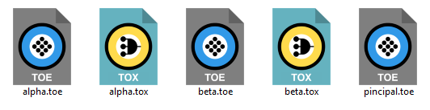
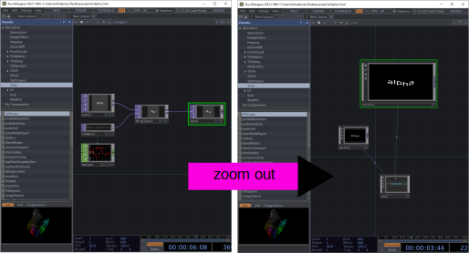
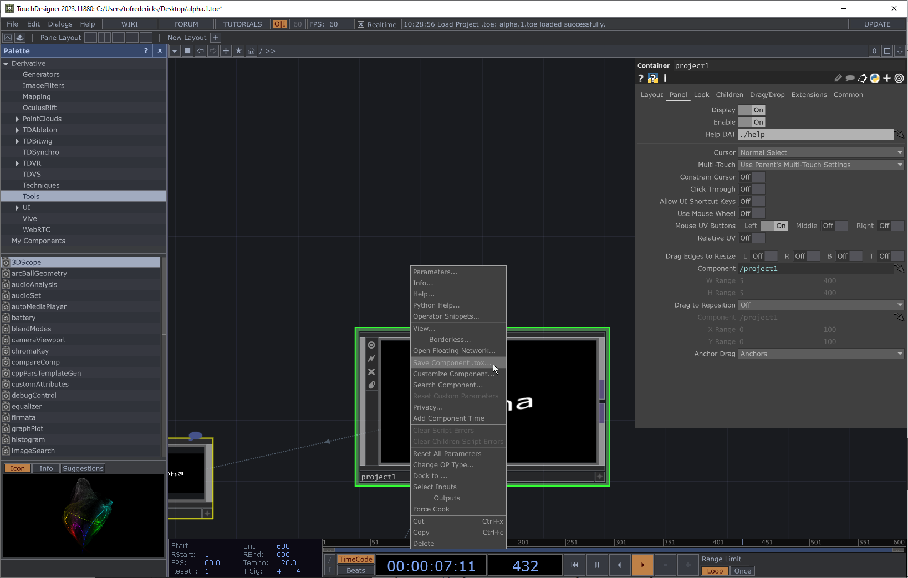
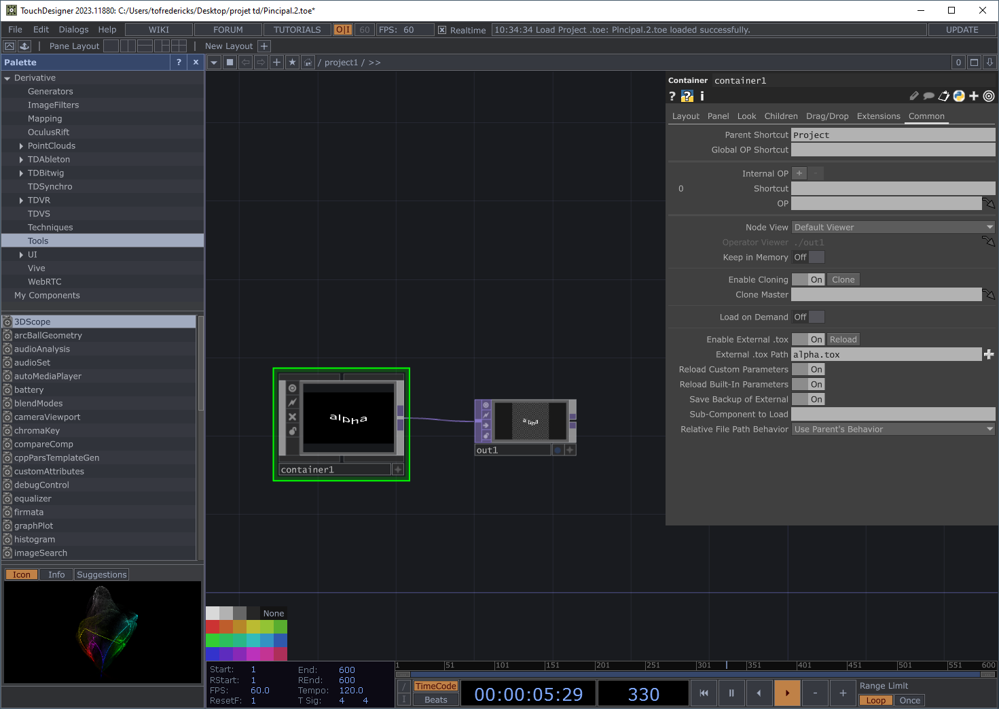
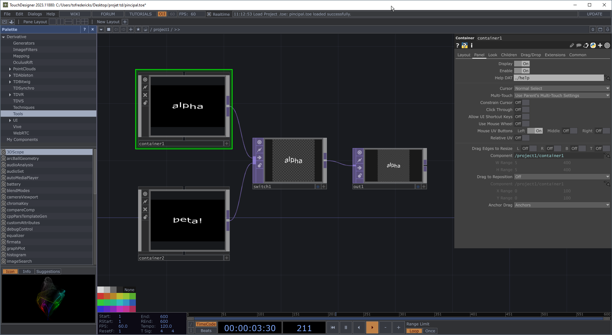
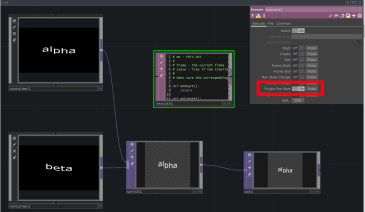

# Enchâsser un .toe dans un autre .toe en passant par un .tox

Dans cet exemple, *alpha.toe* et *beta.toe* vont être enchâssés dans *principal.toe*. 

Nous devons convertir *alpha.toe* et *beta.toe* en tant que *.tox* pour les charger dans *principal.toe*.

Tous les fichiers ( *principal.toe*, *alpha.toe*, *beta.toe* , *alpha.tox*, *beta.tox* ) doivent idéalement être dans le même dossier.



L'exemple complet peut être téléchargé ici : [toe_dans_toe_par_tox.zip](toe_dans_toe_par_tox.zip)


## Ouvrir *alpha.toe* et accéder à sa configuration




## Exporter le contenu de *alpha.toe* en tant que *.tox*




## Dans *principal.toe* ajouter un *container* et y charger *alpha.tox*




## Faire la même chose pour *beta.toe*

- Exporter le contenu de *beta.toe* en tant que *.tox*
- Dans *principal.toe* ajouter un *container* et y charger *beta.tox*

## Intégrer les deux patchs



## Mises à jour

> [!WARNING] 
> Les modifications effectuées au components dans «principal.toe» ne seront pas sauvegardées!

Chaque fois que vous vouler mettre à jour les component alpha et beta dans principal vous devez refaire l'exportation du *.toe* en *.tox*!

## Script pour la mise à jour (sauvegarde) automatique des COMP externes

Le script suivant va être déclencher chaque fois que le patch principal est sauvegardé. Il trouve tous les *COMP* qui sont externes (i.e. dans des fichiers .tox) et les sauvegarde.

### Ajouter un DAT Execute et le configurer



### Coller le code suivant

```python
# me - this DAT
# 
# frame - the current frame
# state - True if the timeline is paused
# 
# Make sure the corresponding toggle is enabled in the Execute DAT.

def onStart():
	return

def onCreate():
	return

def onExit():
	return

def onFrameStart(frame):
	return

def onFrameEnd(frame):
	return

def onPlayStateChange(state):
	return

def onDeviceChange():
	return

def onProjectPreSave():
	# Loop through all components in the project
	for comp in root.findChildren(type=COMP):
		if comp.par.externaltox and comp.par.externaltox.eval():
			tox_path = comp.par.externaltox.eval()
			comp.save(tox_path)  # Save the component to its external .tox file
			print(f"Saved: {comp.name} -> {tox_path}")
	return

def onProjectPostSave():
	return

	
```