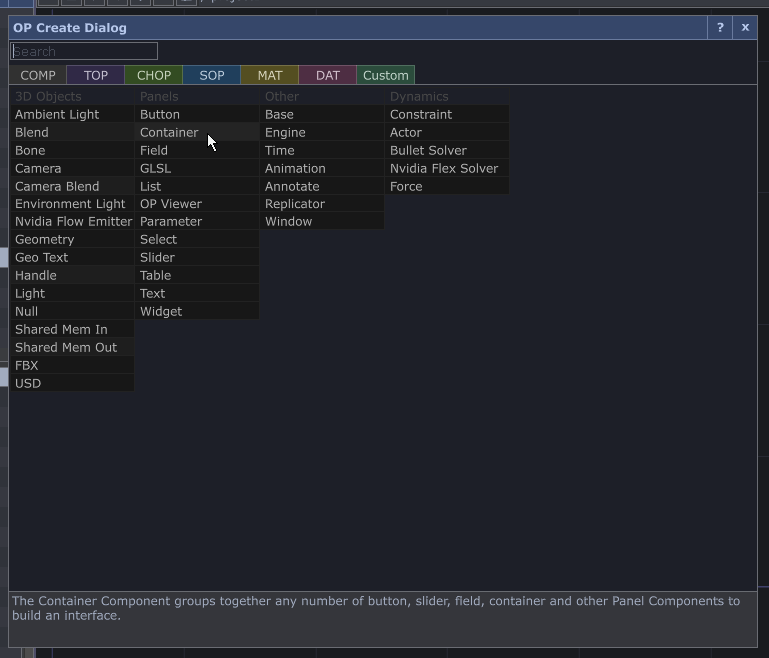

# Enchâsser un .toe dans un autre .toe en passant par un .tox

Dans cet exemple, *alpha.toe* et *beta.toe* vont être enchâssés dans *principal.toe*. 

Nous devons convertir *alpha.toe* et *beta.toe* en tant que *.tox* pour les charger dans *principal.toe*.

Tous les fichiers ( *principal.toe*, *alpha.toe*, *beta.toe* , *alpha.tox*, *beta.tox* ) doivent idéalement être dans le même dossier.

L'exemple complet peut être téléchargé ici : [toe_dans_toe_par_tox.zip](./toe_dans_toe_par_tox.zip)

## Ouvrir *alpha.toe* et accéder à sa configuration

## Exporter le contenu de *alpha.toe* en tant que *.tox*

## Dans *principal.toe* ajouter un *container* et y charger *alpha.tox*

## Faire la même chose pour *beta.toe*

- Exporter le contenu de *beta.toe* en tant que *.tox*
- Dans *principal.toe* ajouter un *container* et y charger *beta.tox*

## Intégrer les deux patchs

## Mises à jour

> [!WARNING] 
> Les modifications que vous effectuer au components dans principal.toe ne seront pas sauvegardées!

Chaque fois que vous vouler mettre à jour les component alpha et beta dans principal vous devez refaire l'exportation du *.toe* en *.tox*!