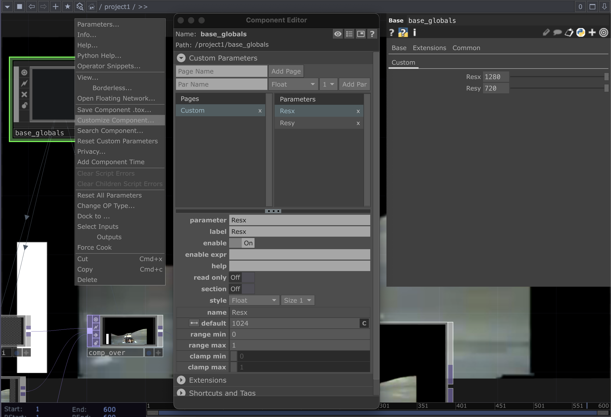

# TouchDesigner : Globales

Les variables globales permettent de regrouper dans un endroit des valeurs qui sont utilisées ailleurs dans votre projet. Par exemple, il est pertinent d'avoir une variable pour la résolution finale d'affichage parce qu'elle risque de changer selon le contexte de présentation. En changeant la valeur de la variable, la nouvelle valeur est appliquée à l'ensemble du projet.

Pour avoir des variables globales dans votre projet TouchDesigner :
- Créer un _COMP Base_
- Le nommer `base_globals`
- Avec un _clic droit_ ouvrir _Customize Component_
- Ajouter des paramètres qui deviendront des globales
    - Assigner des valeurs par défaut
    - Par exemple, on peut créer les variables `Resx` et `Resy` pour la résolution finale d'affichage
- Dans l'inspecteur des paramètres, il est possible de modifier les valeurs des variables
- Ailleurs dans TouchDesigner, la valeur des variables gbobales peut être récupérée avec la commande `op('base_globals').par.NOM_DE_LA_VARIABLE`
    - Par exemple, pour récupérer les valeurs des variables `Resx` et `Resy` vous pouvez utiliser les commandes suinvates :
        - `op('base_globals').par.Resx`
        - `op('base_globals').par.Resy`

