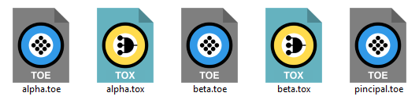
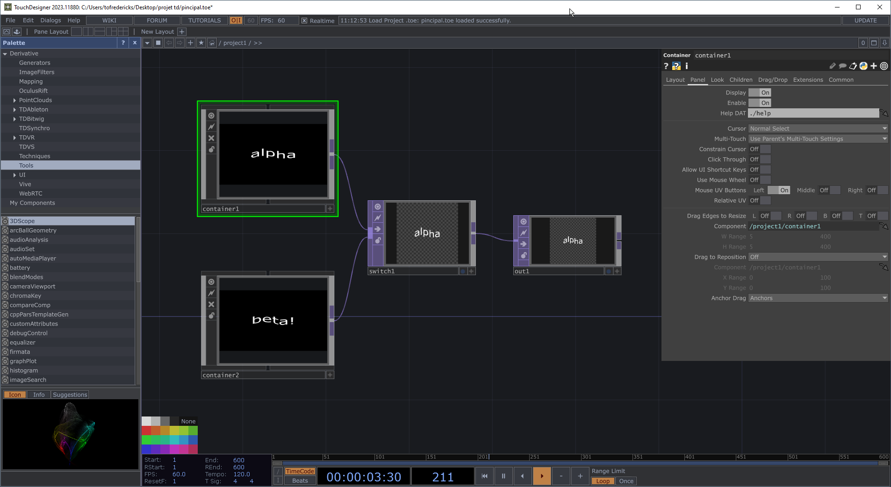
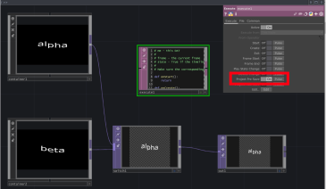

# Modularisation d'un projet TouchDesigner

## Exemple

Dans cet exemple, les sources *alpha.toe* et *beta.toe* vont être converties en *.tox* pour être intégrées dans *principal.toe*. 

Tous les fichiers (*principal.toe*, *alpha.toe*, *beta.toe* ainsi que les fichiers générés *alpha.tox* et *beta.tox*) doivent idéalement se trouver dans le même dossier.



L'exemple complet peut être téléchargé ici : [toe_dans_toe_par_tox.zip](toe_dans_toe_par_tox.zip)

### Ouvrir *alpha.toe* et accéder à sa configuration


### Exporter le contenu de *alpha.toe* en tant que *.tox*


### Dans *principal.toe*, ajouter un *container* et y charger *alpha.tox*


### Faire la même chose pour *beta.toe*

- Exporter le contenu de *beta.toe* en tant que *.tox*  
- Dans *principal.toe*, ajouter un *container* et y charger *beta.tox*

### Intégrer les deux patchs



### Mises à jour

> [!WARNING]  
> Les modifications effectuées aux composants dans « principal.toe » ne seront pas sauvegardées !

Chaque fois que vous voulez mettre à jour les composants *alpha* et *beta* dans *principal*, vous devez refaire l'exportation des *.toe* en *.tox* et rédémarrer *principal.toe*.

## AVANCÉ! Script pour la (sauvegarde) automatique des COMP externes

> [!WARNING]  
> Ce script est pour les utilisateurs avancés!

Le script suivant sera déclenché chaque fois que le patch principal est sauvegardé. Il trouve tous les *COMP* qui sont externes (i.e. liés à des fichiers .tox) et les sauvegarde automatiquement.

### Ajouter un DAT Execute et le configurer



### Coller le code suivant

```python
# me - this DAT
# 
# frame - the current frame
# state - True if the timeline is paused
# 
# Make sure the corresponding toggle is enabled in the Execute DAT.

def onStart():
	return

def onCreate():
	return

def onExit():
	return

def onFrameStart(frame):
	return

def onFrameEnd(frame):
	return

def onPlayStateChange(state):
	return

def onDeviceChange():
	return

def onProjectPreSave():
	# Loop through all components in the project
	for comp in root.findChildren(type=COMP):
		if comp.par.externaltox and comp.par.externaltox.eval():
			tox_path = comp.par.externaltox.eval()
			comp.save(tox_path)  # Save the component to its external .tox file
			print(f"Saved: {comp.name} -> {tox_path}")
	return

def onProjectPostSave():
	return
```