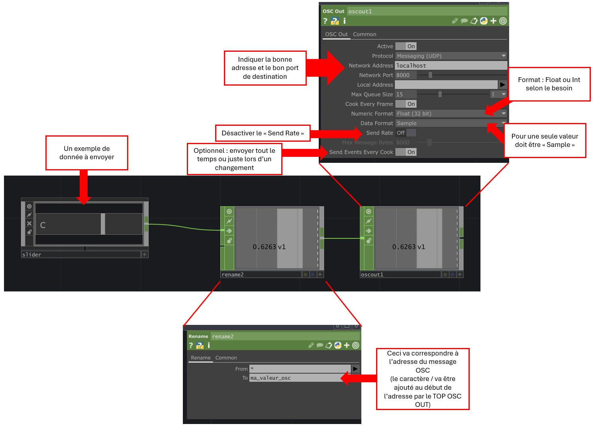
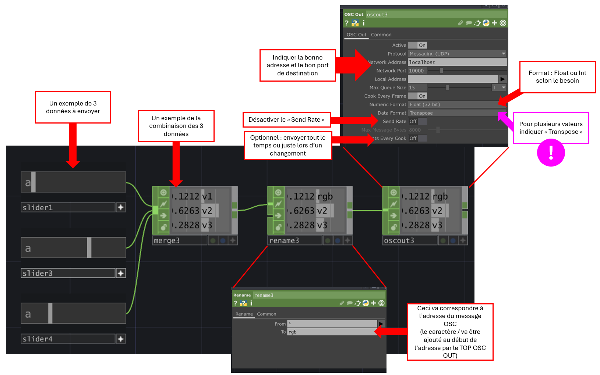

# Envoi OSC dans TouchDesigner

## Préalable(s)

- [Protocole Open Sound Control (OSC)](/osc/README.md)

## Code TouchDesigner pour envoyer 1 donnée



## Code TouchDesigner pour envoyer 3 données



### Exemple de code Arduino pour la réception de trois données avec l'adresse /rgb

Partir du code du [Tutoriel: OscBridge, M5 Angle et le bouton](../../m5stack/atom/tutoriel/angle-button-oscbridge.md).

Ajouter le code suivant à _loop()_ juste après _M5.update()_ :
```cpp
  // TRIGGER maReceptionMessageOsc() IF AN OSC MESSAGE IS RECEIVED :
  monOsc.onOscMessageReceived(maReceptionMessageOsc);
```

Ajouter la fonction suivante à _l'espace global_ :
```cpp
void maReceptionMessageOsc(MicroOscMessage& oscMessage) {
  // IF THE OSC ADDRESS IS "/pixel"
  if (oscMessage.checkOscAddress("/rgb")) {
    // PARSE THREE int ARGUMENTS
    int red = oscMessage.nextAsInt();
    int green = oscMessage.nextAsInt();
    int blue = oscMessage.nextAsInt();
    // USE THE VALUES TO CREATE A COLOR
    pixel = CRGB(red, green, blue);
    FastLED.show();
  } 
}
```
