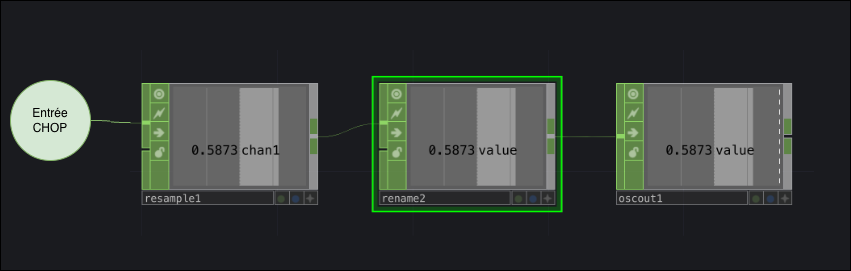
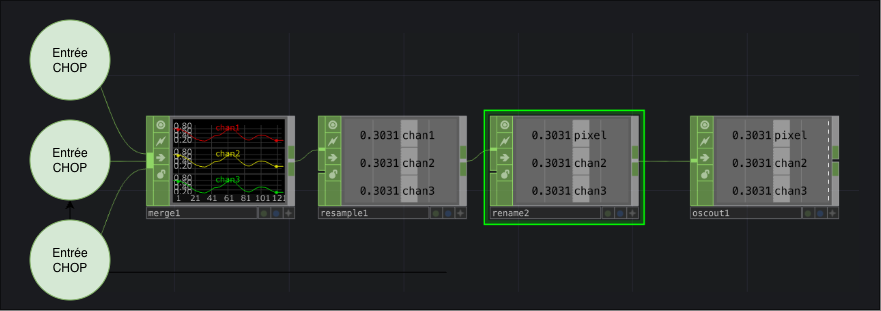

# Envoi OSC dans TouchDesigner

## Préalable(s)

- [Protocole Open Sound Control (OSC)](/osc/)

## Code TouchDesigner pour envoyer 1 donnée


* OP **resample1**
  * Paramètre **Sample Rate** = `50` : l'intervalle à laquelle les données sont envoyées (50 Hz équivaut à chaque 20 millisecondes).
* OP **rename2**
  * Paramètre **From** = `*`
  * Paramètre **To** = adresse OSC du message sans '/'
* OP **oscout1**
  * Paramètre **Network Address** = adresse IP du destinataire (`127.0.0.1 `ou `localhost` pour la machine elle-même)
  * Paramètre **Network Port** = port IP du destinataire 
  * Paramètre **Numeric Format** = `Int` ou `Float` selon le besoin
  * Paramètre **Data Format** = `Sample`
  * Paramètre **Send Rate** = `Off` 
  * Paramètre **Send Events Every Cook** = `Off` pour envoyer la valeur seulement lorsqu'elle change


## Code TouchDesigner pour envoyer 3 données


* OP **merge1** : combine les valeurs à envoyer
* OP **resample1**
  * Paramètre **Sample Rate** = `50` : l'intervalle à laquelle les données sont envoyées (50 Hz équivaut à chaque 20 millisecondes).
* OP **rename2**
  * Paramètre **From** = `*`
  * Paramètre **To** = adresse OSC du message sans '/'
* OP **oscout1**
  * Paramètre **Network Address** = adresse IP du destinataire (`127.0.0.1 `ou `localhost` pour la machine elle-même)
  * Paramètre **Network Port** = port IP du destinataire 
  * Paramètre **Numeric Format** = `Int` ou `Float` selon le besoin
  * Paramètre **Data Format** = `Transpose`
  * Paramètre **Send Rate** = `Off` 
  * Paramètre **Send Events Every Cook** = `Off` pour envoyer la valeur seulement lorsqu'elle change

### Exemple de code Arduino pour la réception de trois données avec l'adresse /rgb

Partir du code du [Tutoriel: OscBridge, M5 Angle et le bouton](../../m5stack/atom/tutoriel/angle-button-oscbridge.md).

Ajouter le code suivant à _loop()_ juste après _M5.update()_ :
```cpp
  // TRIGGER maReceptionMessageOsc() IF AN OSC MESSAGE IS RECEIVED :
  monOsc.onOscMessageReceived(maReceptionMessageOsc);
```

Ajouter la fonction suivante à _l'espace global_ :
```cpp
void maReceptionMessageOsc(MicroOscMessage& oscMessage) {
  // IF THE OSC ADDRESS IS "/pixel"
  if (oscMessage.checkOscAddress("/rgb")) {
    // PARSE THREE int ARGUMENTS
    int red = oscMessage.nextAsInt();
    int green = oscMessage.nextAsInt();
    int blue = oscMessage.nextAsInt();
    // USE THE VALUES TO CREATE A COLOR
    pixel = CRGB(red, green, blue);
    FastLED.show();
  } 
}
```
