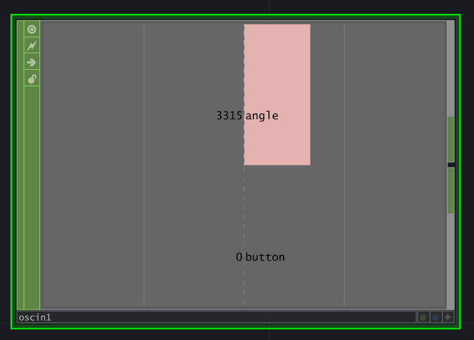
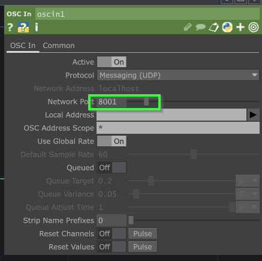
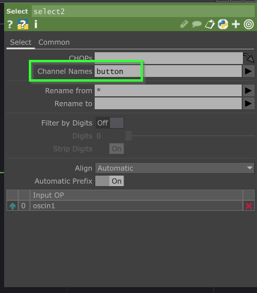
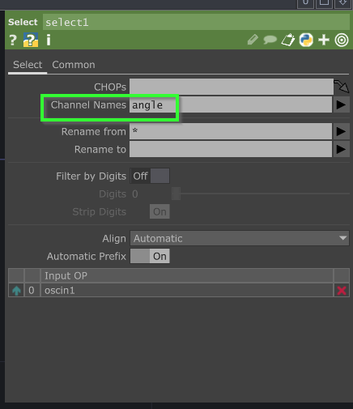
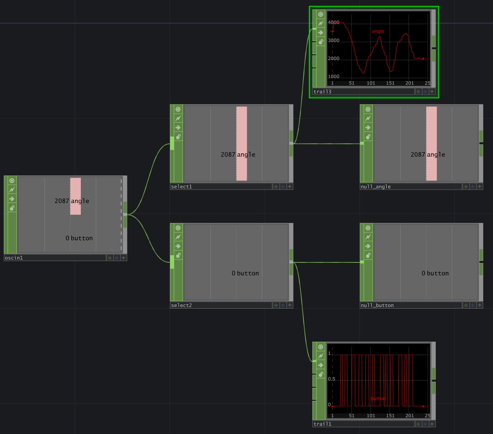

# Réception de l'OSC dans TouchDesigner

> [!WARNING]
> Dans TouchDesigner les adresses de messages OSC perdent leur /.
> L'adresse OSC /bouton devient bouton dans TouchDesigner.

## Ajouter un CHOP _Osc In_

##  Configurer les paramètres du _Osc In_

Utiliser le même numéro de port que celui défini dans l'expéditeur.

##  Isoler les différents messages OSC avec des CHOP _Select_

