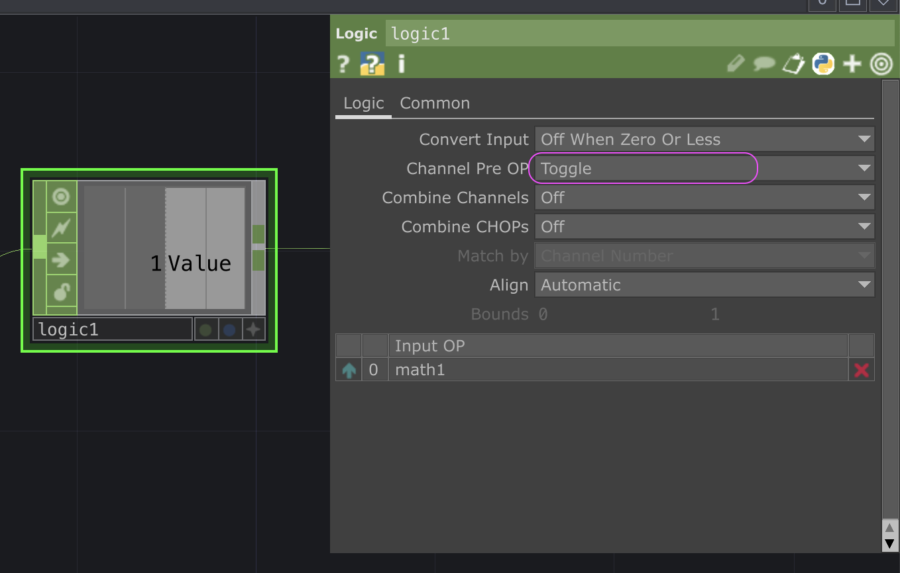

# TouchDesigner : Basculement (*flip flop*)

`OP` utilisé :
- `Logic CHOP`

Configuration :
- Le `Logic CHOP` doit avoir son paramètre `[Logic]Channel Pre OP` au mode `Toggle` 
- L'entrée du `Logic CHOP` doit être `0` ou `1`
-Chaque fois que l'entrée passe à `1`, la sortie va basculer entre `0` et `1`

