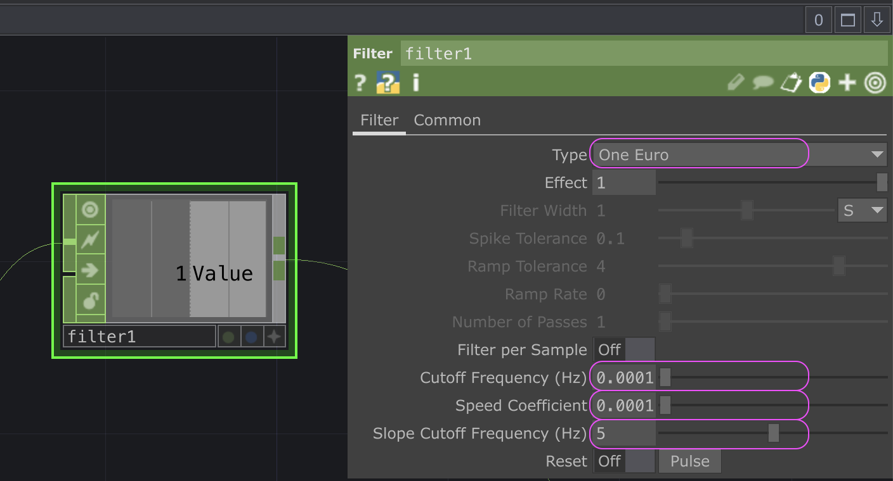

# TouchDesigner : Glissement

`OP` utilisé :
- `Filter CHOP`

Le filtre One Euro est particulièrement utile lorsqu’on souhaite une réponse rapide : il réagit rapidement aux grands changements de valeur et atténue le tremblement dans l’entrée. À basse vitesse, une fréquence de coupure faible stabilise le signal en réduisant les tremblements, mais à mesure que la vitesse augmente, la fréquence de coupure est augmentée afin de réduire la latence. 

- **Cutoff Frequency** : Diminuez-la si les tremblements à basse vitesse posent un problème.
- **Speed Coefficient** : Augmentez-le si le décalage (latence) à haute vitesse est un problème.
- **Slope Cutoff Frequency** : Évite les pics de dérivée causés par les tremblements.

Voici une procédure pour ajuster le filtre One Euro :
- **Cutoff Frequency** à une valeur intermédiaire raisonnable, comme 1 Hz. 
- Définir le **Speed Coefficient** à 0.
- Ensuite, _déplacer l'entrée à une vitesse très faible_ tout en ajustant la **Slope Cutoff Frequency** pour éliminer les tremblements tout en conservant une latence acceptable lors de ces mouvements lents. (Réduire **Slope Cutoff Frequency** diminue les tremblements, mais augmente la latence. Cette fréquence doit être > 0.)
- Ensuite, _déplacer rapidement l'entrée_ tout en augmentant progressivement **Speed Coefficient**, en portant attention à la réduction de la latence. Commencer par trouver le bon ordre de grandeur pour ajuster ce coefficient. Ne pas hésiter à commencer avec des valeurs comme 0.001 ou 0.0001. Multiplier ou diviser le **Speed Coefficient** par 10 jusqu’à observer un effet sur la latence lors des mouvements rapides.

Noter que les paramètres **Speed Coefficient** et **Slope Cutoff Frequency** ont une relation conceptuelle claire :
- Si la latence à haute vitesse est un problème, augmenter le **Speed Coefficient**.
- Si les tremblements à basse vitesse sont un problème, réduire **Slope Cutoff Frequency**.