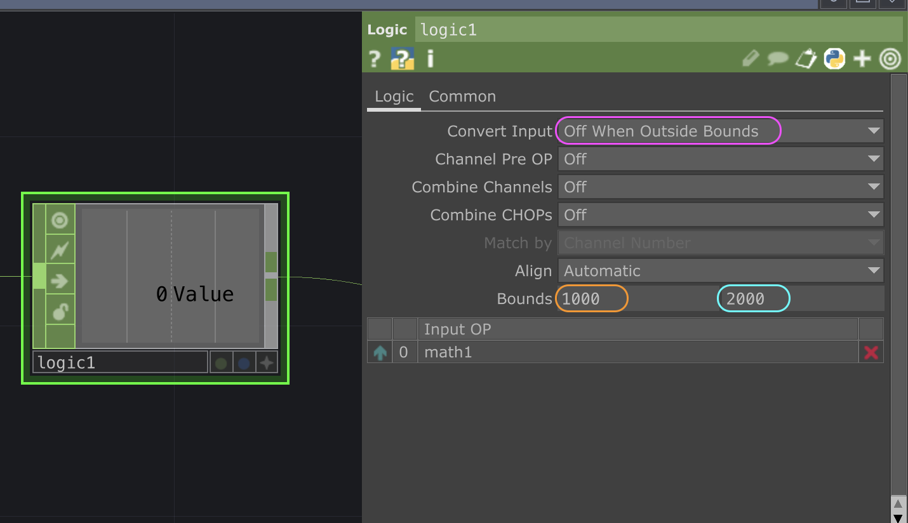

# TouchDesigner : Plage

`OP` utilisé :
- `Logic CHOP`

- Les valeurs du Bounds dépendent de la plage d'entrée. Si un capteur est utilisé, il faut **observer** la plage du capteur, c'est-à-dire son minimum et son maximum mesuré dans le contexte réel.

