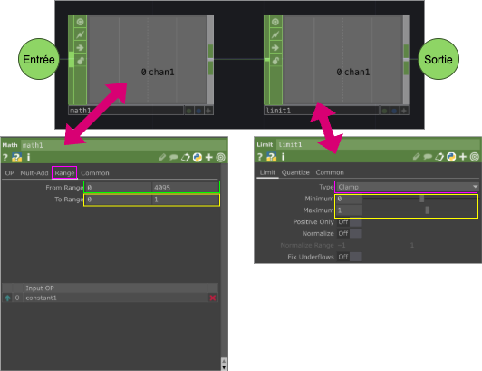

# TouchDesigner : Proportion

`OP` utilisés :
- `Math CHOP`
- `Limit CHOP`

    
Configuration :
- Les valeurs From Range du `Math CHOP` dépendent de la plage d'entrée. Si un capteur est utilisé, il faut **observer** la plage du capteur, c'est-à-dire son minimum et son maximum mesuré dans le contexte réel.
- Les valeurs To Range du  `Math CHOP` dépendent du contexte, mais sont souvent entre 0.0 et 1.0.
- Les valeurs du minimum et maximum du `Limit CHOP` doivent correspondre au To Range du `Math CHOP`

