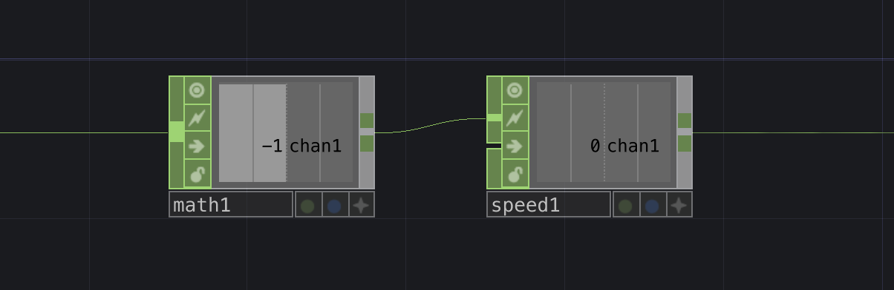
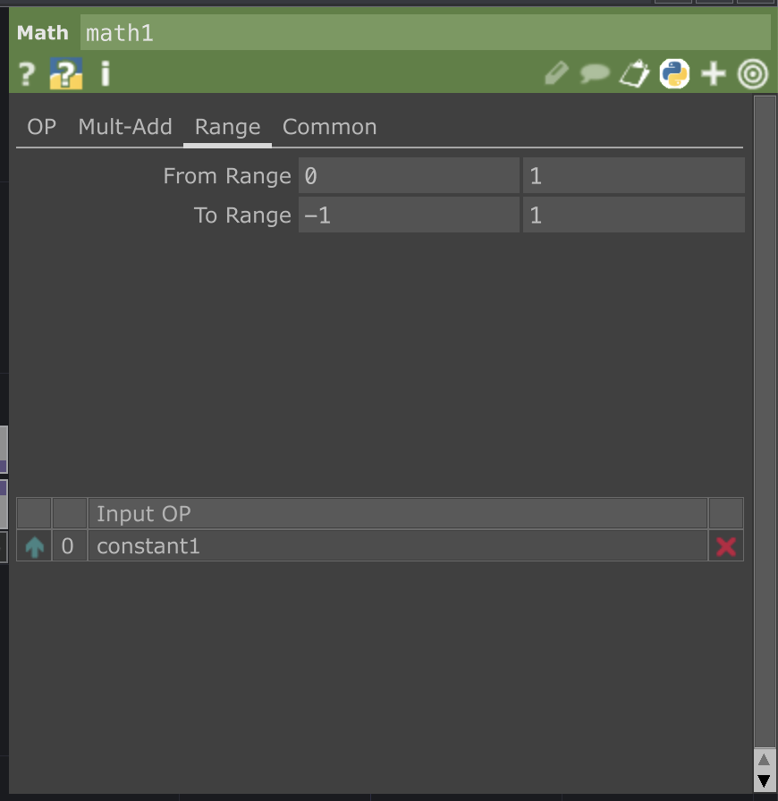

# TD : Variation contrôlée

Tant que le signal d’entrée reste à l’intérieur d’une plage définie, une valeur en mémoire augmente à une vitesse constante ; si le signal sort de la plage, la valeur en mémoire diminue à une vitesse qui peut être différente.  

`OP` utilisés :
- `Math CHOP`
- `Speed CHOP`

Pour réaliser la variation contrôlée, nous voulons une entrée qui est soit 0 ou 1 (aucune valeur intermédiaire, utiliser une [plage](../plage/) sinon) :
- Quand l'entrée est 1, on veut que la sortie augmente graduellement avec une vitesse positive
- Quand l'entrée est 0, on veut que la sortie réduise graduellement avec une vitesse négative

Le `Math CHOP` convertit l'entrée en valeurs de vitesses :
- Quand l'entrée est 1, la vitesse est 1
- Quand l'entrée est 0, la vitesse est -1

Les vitesses de 1 et -1 peuvent être changées (par exemple 0.5 et -0.5 correspondent à la moitié de la vitesse).

Le `Speed CHOP` prend la vitesse et incrémente ou décrémente la valeur de sortie. Il est important de limiter la valeur de sortie en activant le mode limite Clamp.

