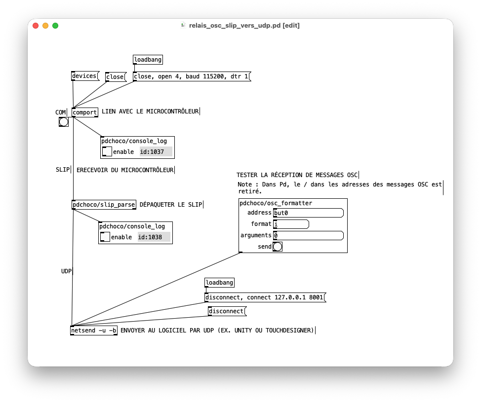
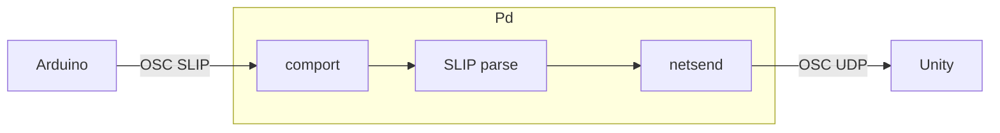

# Tutoriel Flappy Bird : Unity, Pd, OSC et Arduino Nano avec bouton d’arcade

Quand on appuie sur un bouton d’Arcade, cela envoie le message OSC SLIP `/but0 1` à Pd qui le relaye par UDP à Unity.


### Préalables

- Suivre le [Tutoriel relais MicroOsc : Envoi d’OSC SLIP d’un Arduino Nano avec un bouton d’arcade vers OSC UDP](/tutoriels/arcade/relais/)
- Fourcher (*forker*) le dépôt [thomasfredericks/unity-flappybird](https://github.com/thomasfredericks/unity-flappybird).
- Suivre les instructions pour [l’intégration d’extOSC](/logiciels/unity/osc/extosc/).

### Investiguer le code Unity

Identifier le code Unity pour trouver le bloc de code ou la méthode qui :
- Démarre le jeu.
- Bat les ailes du personnage.

Dans le script `InputProcess` on retrouve les lignes suivantes :
```csharp
    public GameManager gameManager;
    public Player player;
```

Ainsi que celles-ci :
```csharp
    void Update()
    {
        if ( (Input.GetKeyDown(KeyCode.Space) || Input.GetMouseButtonDown(0)))
        {
            gameManager.StartGame(); // Ignored if game is already playing, handled in GameManager
            player.Jump();}
    }
```


### Modifier le code Unity

Il faut ajouter les propriétés suivantes dans la classe de notre script `OscProcess` :
```csharp
    public GameManager gameManager;
    public Player player;
```

Nous modifions aussi notre méthode `TraiterMesageBut0` du script `OscProcess` :
```csharp
    // TRAITER LA VALEUR ICI !
    if (valeur == 1)
    {
        gameManager.StartGame(); // Ignored if game is already playing, handled in GameManager
        player.Jump();
    } else {

    }
```


> [!NOTE]
> Appuyer sur Play pour partir le projet Unity!

### Le patcher Pd

Le patcher Pd `relais_osc_slip_vers_udp.pd` permet :
- D’envoyer des messages OSC UDP à Unity.
- De relayer les messages OSC SLIP reçus par `comport` en OSC UDP à Unity.



Télécharger le patcher ici : [relais_osc_slip_vers_udp.pd](./relais_osc_slip_vers_udp.pd)

> [!WARNING]
> Dans le patcher `relais_osc_slip_vers_udp.pd`, il faut s’assurer que le port UDP est le même que celui du `OSC Receiver` du GameObject `OSC` dans Unity. Il est de 8001 dans l’image plus bas, mais est-ce que c’est le bon ?

Il est possible de tester la réception de l’OSC dans Unity à l’aide de `pdchoco/osc_formatter`. Y entrer les informations suivantes et appuyer sur `send` :
- **address** : `but0` (ce qui correspond en OSC à /but0)
- **format** : `i` (un entier)
- **arguments** : `1`


> [!NOTE]
> Terminer de configurer `comport` et appuyer sur le bouton d’arcade ; Flappy devrait battre des ailes !

Les messages OSC SLIP sont envoyés à Pure Data qui les relaye à Unity en OSC UDP.

