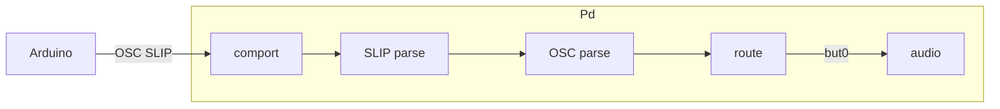
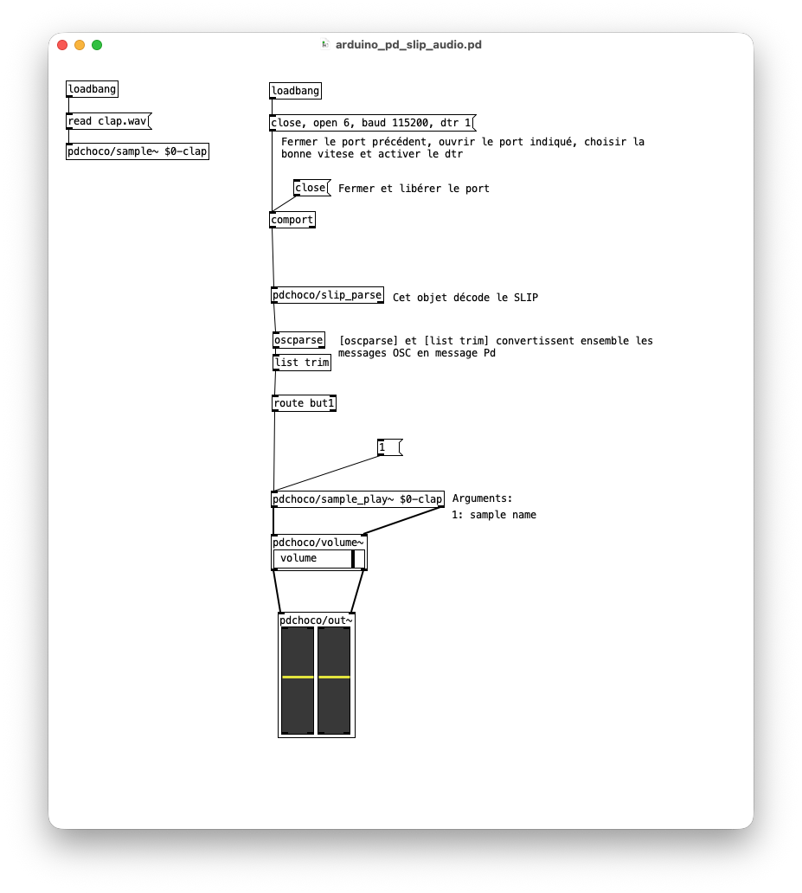

# Tutoriel MicoOsc audio : Envoi d’OSC SLIP d’un Arduino Nano avec un bouton d’arcade pour déclencher de l’audio dans Pd

Ce tutoriel montre comment utiliser [MicroOsc SLIP](/fabrication/arduino/microosc/slip/) pour envoyer les changements d’état d’un bouton vers Pd pour déclencher de l’audio.

Préalables :
- Suivre les instruction pour partir un [nouveau projet PlatformioIO](/fabrication/platformio/nouveau/).
- Suivre les instructions pour l’installation de [MicroOsc SLIP](/fabrication/arduino/microosc/slip/).



Branchement sur Arduino Terminals :

| Bouton d’arcade | Arduino Terminals |
|---------|---------|
| Positif de la DEL (+)     | 3 (sortie analogique) |
| Négatif de la DEL (–)     | GND |
| Une broche de l’interrupteur | 2 (entrée numérique) |
| Autre broche de l’interrupteur | GND (via le négatif de la DEL) |


```cpp
#include <Arduino.h>

#include <Bounce2.h>
Bounce2::Button but0;

#include <MicroOscSlip.h>
MicroOscSlip<128> monOsc(&Serial); 

void setup()
{
    Serial.begin(115200);

    but0.attach(2, INPUT_PULLUP);
    but0.setPressedState(LOW);

    pinMode(3, OUTPUT);

}

void loop()
{
    but0.update();


    if (but0.pressed()) { // Bouton vient d’être appuyé
        /*
        // Ancienne méthode d’envoi ASCII 
        Serial.print("but0");
        Serial.print(" ");
        Serial.print(1);
        Serial.println();
        */
        monOsc.sendInt("/but0", 1);
    }

    if (but0.released()) { // Bouton vient d’être relâché
         /*
        // Ancienne méthode d’envoi ASCII 
        Serial.print("but0");
        Serial.print(" ");
        Serial.print(0);
        Serial.println();
        */
        monOsc.sendInt("/but0", 0);
    }

    if (but0.isPressed()) { // Bouton maintenu
        digitalWrite( 3 , HIGH );
    } else {
        digitalWrite( 3 , LOW );
    }

}
```

Le code Arduino peut être combiné avec ce patcher pour déclencher la lecture d’un fichier audio lorsqu’on appuie sur le bouton d’arcade.



Télécharger le patcher ici : [arduino_pd_slip_audio.pd](./arduino_pd_slip_audio.pd)