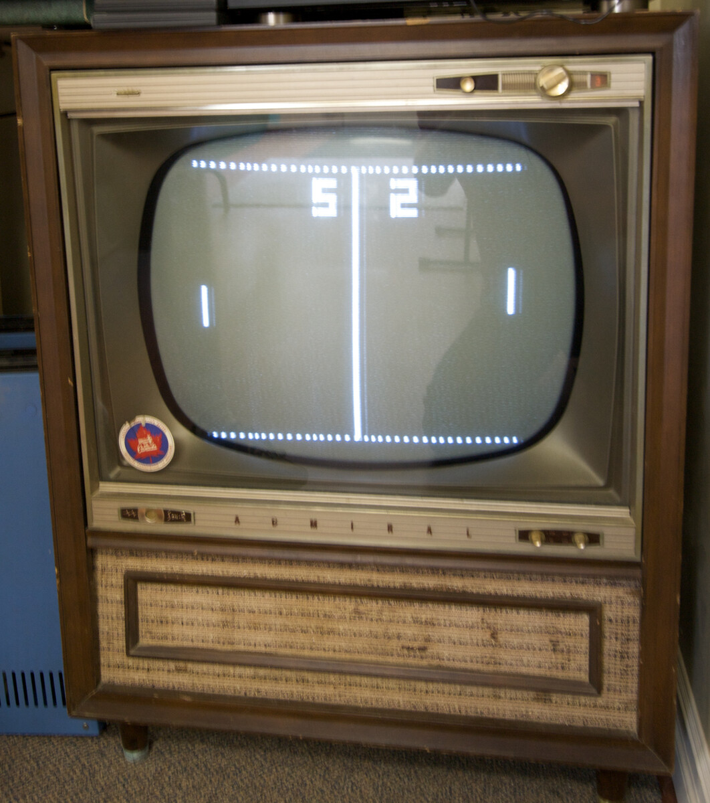
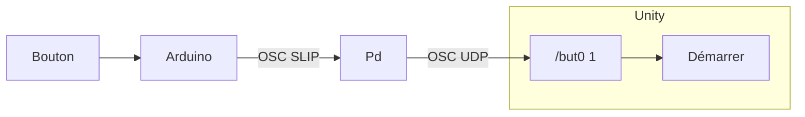
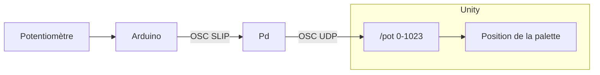
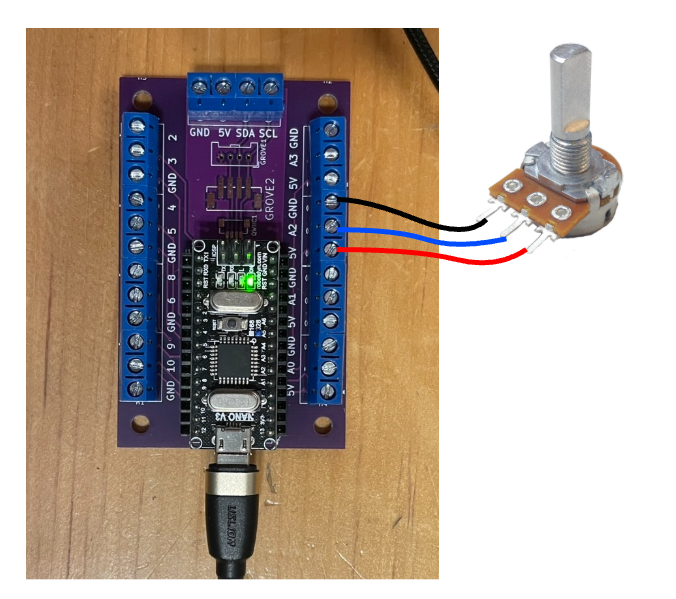

# Tutoriel Pong : Unity, Pd, OSC et Arduino Nano avec bouton d’arcade et potentiomètre

Dans ce tutoriel, nous voulons contrôler le jeu [thomasfredericks/unity-pong](https://github.com/thomasfredericks/unity-pong) avec un bouton pour le lancer de la balle et un [potentiomètre](/fabrication/electronique/composants/potentiometre/) pour la position de la palette.   



### Comportement désiré du bouton

- Quand on appuie sur un bouton d’Arcade :
    - Arduino envoie le message OSC SLIP `/but0 1` à Pd.
    - Pd le relaye par UDP à Unity.
    - Unity lance la balle de Pong.



> [!IMPORTANT]
> Nous traitons le bouton comme un **événement discret**.
> Le message n’est envoyé que lors de l’appui ou du relâchement.
> Si le bouton est maintenu, rien de nouveau n’est envoyé.
> Sa valeur est booléenne : `0` ou `1`.

### Comportement désiré du potentiomètre

- Quand on tourne le potentiomètre :
    - Arduino envoie le message OSC SLIP `/pot` suivi d’un argument entre `0` et `1023` à Pd.
    - Pd le relaye par UDP à Unity.
    - Unity contrôle la palette du joueur.





> [!IMPORTANT]
> Nous traitons le potentiomètre comme un **flux continu**.
> La valeur est lue continuellement et envoyée de façon régulière à Unity.
> Sa valeur se situe dans une plage de valeurs (typiquement entre `0` et `1023` inclusivement).

### Récapitulatif

| Captation | Type | Fréquence | Plage |
| --- | --- | --- | --- |
| Bouton avec `pressed()` ou `released()` | Évènement discret | Une fois quand l’état du bouton change | `0` ou `1` |
| Potentiomètre avec `analogRead()` | Flux continu | Envoyé de façon continue à chaque 20 millisecondes | Entre `0` et `1023` inclusivement |


### Préalables Arduino

Nous partons du même code et du même circuit que le tutoriel précédent ci-haut.

- Partir un nouveau projet Arduino nommé `pong_bouton_pot_arduino`. Pour *PlatformIO* suivre les instructions pour [partir un nouveau projet PlatformIO](/fabrication/platformio/nouveau/).
- Reproduire le circuit et le code du - Suivre le [Tutoriel relais MicroOsc : Envoi d’OSC SLIP d’un Arduino Nano avec un bouton d’arcade vers OSC UDP](/tutoriels/arcade/relais/).

#### Modifications au circuit et au code Arduino

Ajouter un [potentiomètre](/fabrication/electronique/composants/potentiometre/) au circuit (le bouton d’Arcade n’est pas dans l’image).
*   Broche centrale du potentiomètre -> Pin A2 (ou analogique libre) sur l’Arduino.
*   Les deux autres broches -> 5V et GND.



Pour générer un flux continu, nous allons utiliser la bibliothèque [Chrono](/fabrication/arduino/chrono/) pour lire la valeur du potentiomètre à intervalles réguliers.

Après avoir ajouté Chrono à votre projet, créer un chronomètre pour le flux de données dans l’espace global :
```cpp
Chrono chronoPot;
```

Dans `loop()`, ajouter le code suivant pour envoyer la valeur du potentiomètre à chaque 20 millisecondes :
```cpp
if ( chronoPot.hasPassed(20)) { // SI LE CHRONO DÉPASSE 20 MILLISECONDES
    chronoPot.restart(); // REPARTIR LE CHRONO

    int valeur = analogRead(2); // LECTURE DE LA TENSION ENTRE 0 ET 1023

    monOsc.sendInt("/pot", valeur); // ENVOYER LA VALEUR
}
```

> [!NOTE]
> Téléverser le code sur l’Arduino.
> Cela crée un flux d’environ ~50 messages par seconde (un message par 20 millisecondes) vers Pure Data.

### Pure Data

Télécharger le patcher [relais_osc_slip_vers_udp.pd](./relais_osc_slip_vers_udp.pd), le copier dans le dossier de projet Arduino `pong_bouton_pot_arduino` et configurer [comport](/logiciels/pd/serie/comport).

### Préalables Unity

- Fourcher (*forker*) le dépôt [thomasfredericks/unity-pong](https://github.com/thomasfredericks/unity-pong).
- Renommer le projet `pong_bouton_pot_unity`.
- Le cloner sur votre ordinateur.
- Il y aura ainsi deux dépôts Git pour ce tutoriel :
    - `pong_bouton_pot_arduino` : qui contient le code Arduino et Pure Data.
    - `pong_bouton_pot_unity` : qui contient le code Unity.
- Essayer de jouer au jeu **avant** de le modifier.
    - Cliquer et maintenir le bouton de la souris pour bouger la palette.
    - La touche espace lance la balle. 


> [!NOTE]
> Il faut s’assurer que les # de ports OSC dans Pd et dans Unity sont les mêmes.

### Modifications au code Unity

#### Général

- Suivre les instructions pour l’intégration d’extOSC : [Unity : OSC UDP avec extOSC](/logiciels/unity/osc/extosc/).

#### Le bouton

- Référer au [tutoriel Flappy Bird : Unity, Pd, OSC et Arduino Nano avec bouton d’arcade](/tutoriels/arcade/flappy/) pour ces étapes.
- Trouver dans le code Unity la fonction utilisée pour lancer la balle. Astuce : regarder dans le script attaché au GameObjet `Game Manager`.
- Ajouter à `OscProcess` les variables publiques nécessaire pour parler au script de lancer de la balle.
- Effectuer un `Bind` dans `OscProcess` entre le message `/but0` et une nouvelle fonction de traitement de message (vous référer au tutoriel précédent).
- Dans cette fonction, lorsqu’un `1` est reçu, appeler la fonction qui lance la balle (vous référer au tutoriel précédent).

Extrait de la fonction de traitement du message `/but0` :
```csharp
    // TRAITER LA VALEUR ICI !
    if (valeur == 1)
    {
        // METTRE ICI L’APPEL À LA FONCTION POUR LANCER LA BALLE
        // COMME INDICE, C’EST QQCH COMME : gameState.Throw()
    } else {

    }
```

#### Le potentiomètre

La lecture du potentiomètre donne des valeurs entre 0 et 1023. Nous devons ajuster la plage de ces valeurs pour qu’elles correspondent aux coordonnées de position verticale de la palette.

- Trouver dans le code Unity la fonction qui permet de déplacer la palette. Astuce : regarder dans les scripts attachés au GameObjet `Player`.
- Ajouter  à `OscProcess` les variables publiques nécessaires pour référer à la palette.
- Effectuer un `Bind` dans `OscProcess` entre le message `/pot` et une nouvelle fonction de traitement de message.
- Dans cette fonction, nous n’utilisons **pas** le code à fonctionnement booléen précédent :
```csharp
    // TRAITER LA VALEUR ICI !
    // if (valeur == 1)
    // {
    // } else {
    // }
``` 
- Nous allons plutôt utiliser le code suivant pour une plage de valeurs, qui transforme le flux brut d’une plage entre 0 et 1023 en coordonnées de jeu fluides (par exemple : -1.0 à 1.0). :
```csharp
    // TRAITER LA VALEUR ICI !
    float ajuste = (((float)valeur - potInMin) / (potInMax - potInMin) * (potOutMax - potOutMin) + potOutMin);
    // AJOUTER À LA LIGNE SUIVANTE LE CODE POUR APPLIQUER LA VARIABLE ajuste AU DÉPLACEMENT DE LA PALETTE ICI !
    // COMME INDICE C’EST QQCH COMME : palette.setVercialPosition( ajuste);
```

- Nous devons aussi ajouter les variables (propriétés) suivantes en haut de la **classe** `OscProcess` pour qu’elles puissent être ajustées :
```csharp
public int potInMin = 0;
public int potInMax = 1023;
public float potOutMin = 0.0f;
public float potOutMax = 1.0f;
```


- De retour dans l’éditeur Unity, **lancer le jeu**.
- La palette devrait bouger en fonction de la rotation du potentiomètre, mais ne couvre pas tout le terrain.
- Il faut ajuster les valeurs des variables `potOutMax` et `potOutMin` du script `OscProcess` que vous venez de créer pour que le minimum et le maximum de rotation du potentiomètre corresponde à la coordonnée de position verticale au minimum et maximum de hauteur du terrain.
    - Ajuster manuellement les valeurs `potOutMin` et `potOutMax` dans l’Inspecteur Unity (sans toucher au code).

> [!WARNING]
> Ne pas oublier de faire les révisions (*commits*) des deux dépôts :
> - `pong_bouton_pot_arduino` : qui contient le code Arduino et Pure Data.
> - `pong_bouton_pot_unity` : qui contient le code Unity.