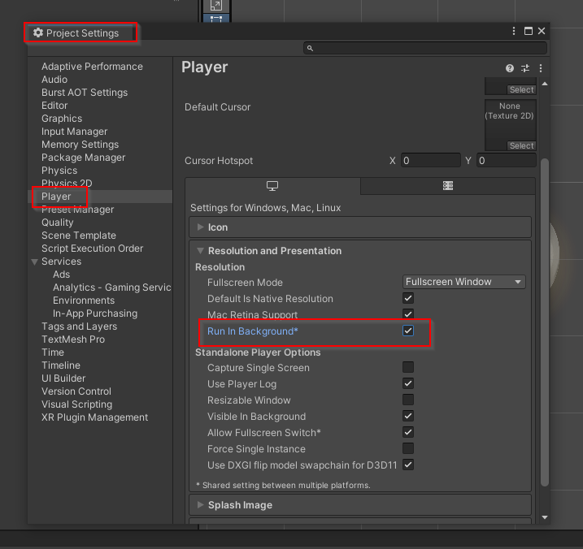

# Exécution du code Unity en arrière-plan

Pour que Unity puisse continuer à rouler son code quand sa fenêtre n'est pas en avant plan, cochez la case «Run in Background» dans «Project Settings→Player→Resolution and Presentation→Run in Background» :

