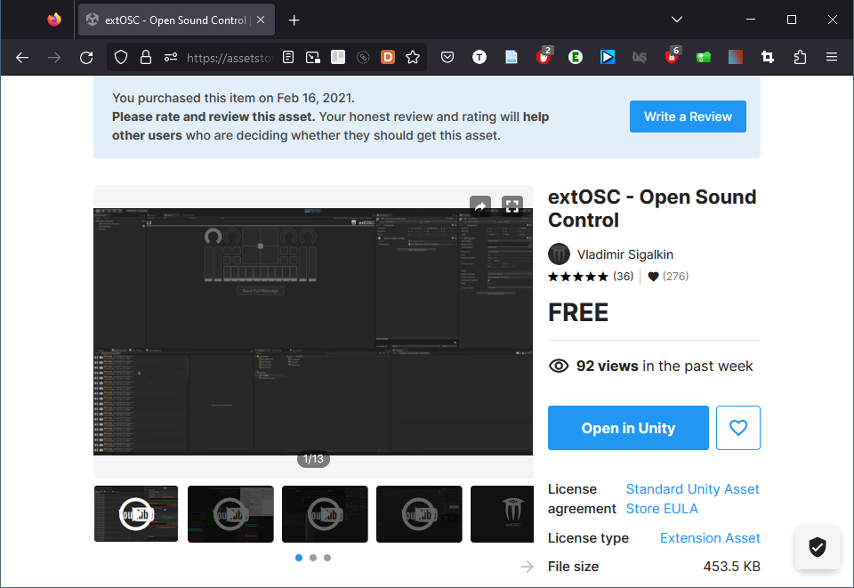
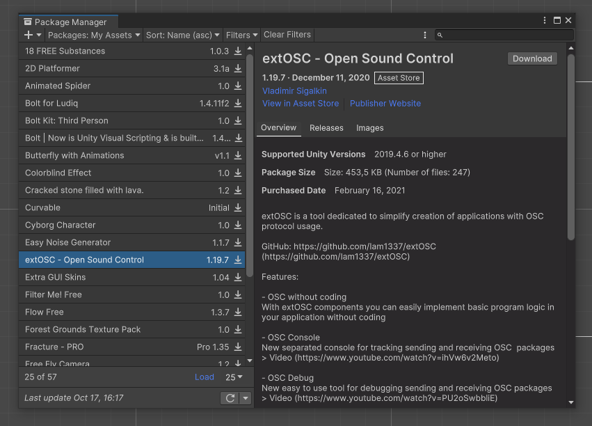
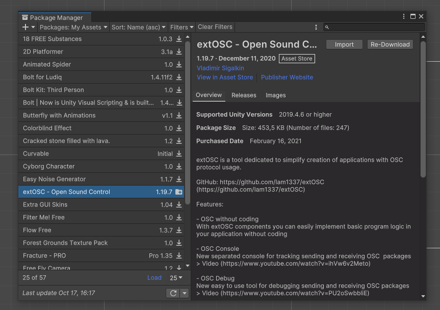
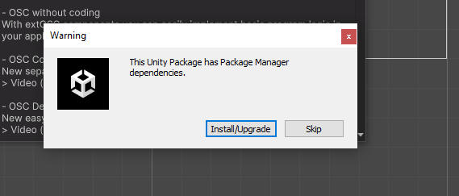
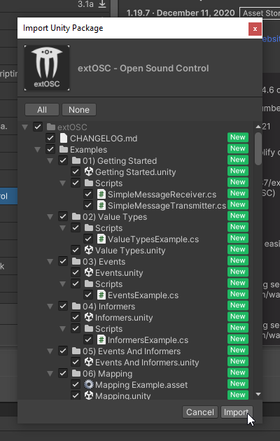
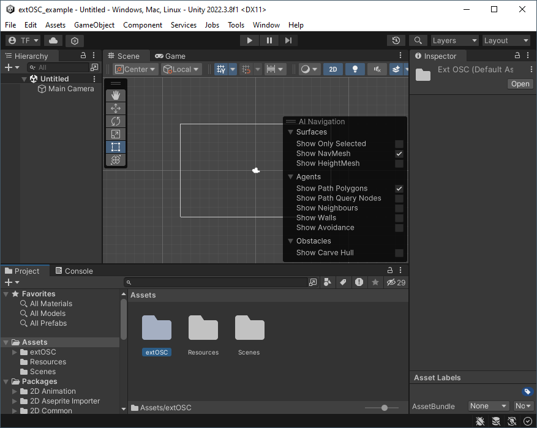
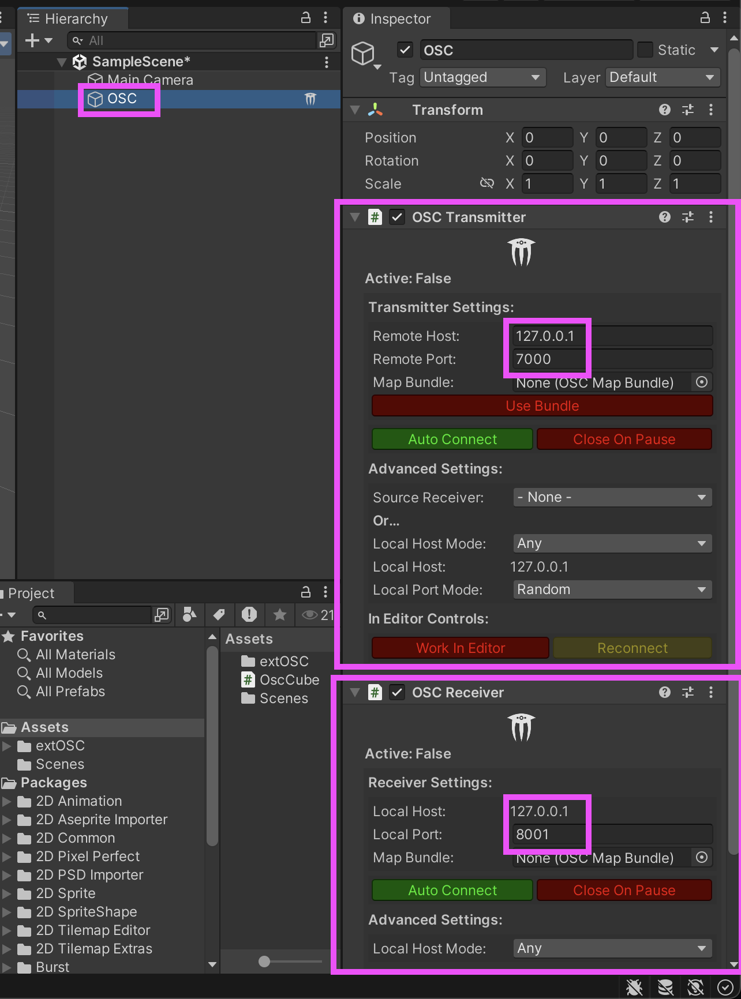
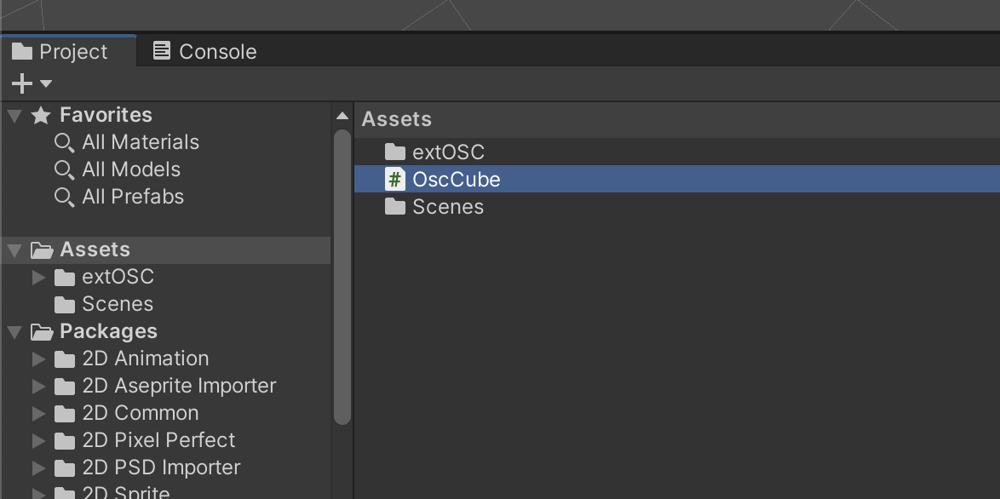
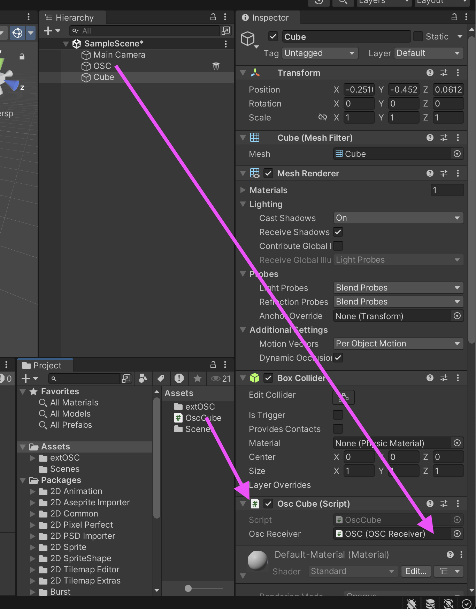

# Unity : OSC UDP avec extOSC

Ce site documente deux paquets permettant d’utiliser OSC via UDP dans Unity :  
- **extOSC** si Visual Scripting **n’est pas utilisé** (le cas le plus courant)  
- **oscjackvs** si Visual Scripting **est utilisé** (moins fréquent)

Cette page présente **extOSC**.

## Préalables

* [Activer l’exécution en arrière-plan](/unity/execution_arriere-plan/)

## Installation de extOSC

Recherchez « extOSC » dans l’[Asset Store](https://assetstore.unity.com/) (assurez-vous d’être connecté à votre compte Unity avant) :  


Cliquez sur le bouton pour ajouter « extOSC » à vos *assets*, puis cliquez de nouveau pour ouvrir l’*asset* dans Unity :  


Téléchargez le paquet « extOSC » à partir du gestionnaire de paquets :  


Cliquez sur le bouton pour importer le paquet « extOSC » :  


Installez toutes les dépendances :  


Importez tous les *assets* :  


Vous devriez maintenant voir *extOSC* dans vos *assets* :  


## Intégration de l’objet de contrôle OSC

> [!Note]
> Effectuez les étapes suivantes une seule fois par scène.

* Créez un nouveau *GameObject* vide nommé `OSC`.
* Ajoutez-y les scripts (inclus avec *extOSC*) `OSCTransmitter` et `OSCReceiver`.
* Configurez ces deux scripts avec les paramètres réseau appropriés.



## Réception d’un message OSC

> [!Note]
> Pour expliquer la réception d'un message OSC, cette section est sous la forme d'un exemple.
> Reproduire et adapter les étapes suivantes pour chaque objet devant recevoir des messages OSC.

Dans cet exemple, nous allons contrôler la rotation d’un Cube à partir de la valeur d’un message OSC `/angle`.

Pour chaque *GameObject* qui doit recevoir de l’OSC, créez un nouveau script (appelé `OscCube` dans cet exemple) :  


### Dans le script

Au tout début du script (après les autres `using`), ajoutez la ligne suivante pour utiliser le paquet **extOSC** :
```csharp
using extOSC;
```

Ensuite, dans la classe (avant les méthodes), déclarez une variable qui fera référence au script `OSCReceiver` :
```csharp
public extOSC.OSCReceiver oscReceiver;
```

Ajoutez également la méthode `Proportion()` (semblable à la fonction `scale` dans Max ou au `Math CHOP` dans TouchDesigner), utile pour adapter les échelles de valeurs :
```csharp
public static float Proportion(float value, float inputMin, float inputMax, float outputMin, float outputMax)
{
    return Mathf.Clamp(((value - inputMin) / (inputMax - inputMin) * (outputMax - outputMin) + outputMin), outputMin, outputMax);
}
```

Ajoutez ensuite la méthode `TraiterOscAngle()` qui sera appelée lorsqu’un message OSC (avec une adresse que nous définirons plus tard dans `Start()`) est reçu :
```csharp
void TraiterOscAngle(OSCMessage message)
{
// Si le message n'a pas d'argument ou l'argument n'est pas un Int on l'ignore
    if (message.Values.Count == 0)
    {
        Debug.Log("No value in OSC message");
        return;
    }
        
    if (message.Values[0].Type != OSCValueType.Int)
    {
        Debug.Log("Value in message is not an Int");
        return;
    }

    // Récupérer la valeur de l’angle depuis le message OSC
    int value = message.Values[0].IntValue;   
    
    // EXEMPLE : utiliser la valeur pour appliquer une rotation
    // Adapter proportionnellement la valeur reçue
    float angle = Proportion(value, 0, 4095, -180, 180);
    // Appliquer la rotation à l’objet
    transform.rotation = Quaternion.Euler(0, angle, 0);
}
```

Dans la méthode `Start()`, associer chaque adresse OSC à la fonction correspondante grâce à `Bind()`.  
Dans cet exemple, le message OSC `/angle` déclenche la fonction `TraiterOscAngle()` :
```csharp
oscReceiver.Bind("/angle", TraiterOscAngle);
```

### Dans l’éditeur Unity

De retour dans l’éditeur Unity :
- Ajouter un *GameObject* (un Cube, dans cet exemple) à la scène.  
- Ajouter-lui le script `OscCube`.  
- Lier le `OSCReceiver` du GameObject `OSC` à la variable publique du script en glissant le GameObject `OSC` sur la variable correspondante dans l’inspecteur.




## Envoi d’un message OSC

### Dans le script qui a besoin d'envoyer un message OSC

 Au tout début du script qui doit recevoir l'OSC, (après les autres `using`), ajouter la ligne suivante pour utiliser le paquet **extOSC** :
```csharp
using extOSC;
```

Ensuite, dans la classe (avant les méthodes), déclarer une variable qui fera référence au script `OSCTransmitter` :
```csharp
public extOSC.OSCTransmitter oscTransmitter;
```
Dans le même script, ajouter et adapter le code suivant à l'endroit où un message OSC doit être envoyé :
```csharp
       var oSCMessage = new OSCMessage("/pixel");  // CHANGER l'adresse /pixel pour l'adresse désirée

        // AJOUTER autant de valeurs que désiré
        // Dans cet exemple, trois entiers sont ajoutés au message
        oSCMessage.AddValue( OSCValue.Int(255) ); // Ajoute l'entier 255
        oSCMessage.AddValue( OSCValue.Int(255) ); // Ajoute un autre 255
        oSCMessage.AddValue( OSCValue.Int(255) ); // Ajoute un troisième 255

        // Envoyer le message 
        oscTransmitter.Send(oSCMessage); 
```

### Dans l’éditeur Unity

De retour dans l’éditeur Unity :
- Lier le `OSCTransmitter` à la variable publique du script en glissant le GameObject `OSC` sur la variable correspondante dans l’inspecteur.


