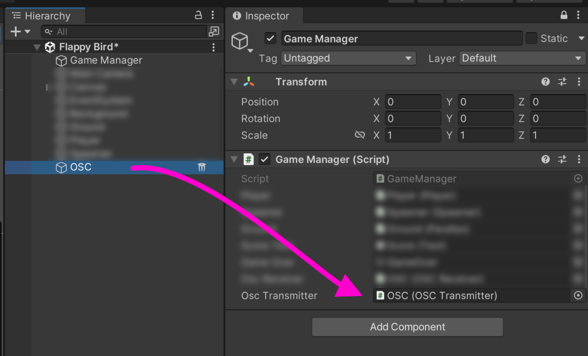

# Unity+extOSC : envoi OSC

<!-- toc -->

## Préalable(s)

* Avoir suivi les instructions sur [l'initialisation d'extOSC](../initialisation/)


## Envoi d’un message OSC événementiel 

Cette section présente comment envoyer un message OSC événementiel (irrégulier ou lié à un évènement) dans Unity.

### Dans le script qui a besoin d'envoyer un message OSC

 Au tout début du script qui doit recevoir l'OSC, (après les autres `using`), ajouter la ligne suivante pour utiliser le paquet **extOSC** :
```csharp
using extOSC;
```

Ensuite, dans la classe (avant les méthodes), déclarer une variable qui fera référence au script `OSCTransmitter` :
```csharp
public extOSC.OSCTransmitter oscTransmitter;
```
Dans le même script, ajouter et adapter le code suivant à l'endroit où un message OSC doit être envoyé :
```csharp
       var oSCMessage = new OSCMessage("/pixel");  // CHANGER l'adresse /pixel pour l'adresse désirée

        // AJOUTER autant d'arguments que désiré
        // Dans cet exemple, trois arguments de type entiers (int) sont ajoutés au message
        oSCMessage.AddValue( OSCValue.Int(255) ); // Ajoute l'entier 255
        oSCMessage.AddValue( OSCValue.Int(255) ); // Ajoute un autre 255
        oSCMessage.AddValue( OSCValue.Int(255) ); // Ajoute un troisième 255

        // Envoyer le message 
        oscTransmitter.Send(oSCMessage); 
```

### Dans l’éditeur Unity

De retour dans l’éditeur Unity :
- Lier le `OSCTransmitter` à la variable publique du script en glissant le GameObject `OSC` sur la variable correspondante dans l’inspecteur.




## Envoi d'un **flux** continu de messages OSC

Cette section présente comment envoyer un **flux** continu de messages OSC. Il y a certaines particularités avec l'envoi d'un flux à partir d'Unity :
- Il faut ralentir la vitesse du flux
- On veut envoyer les messages **après** que la scène est mise à jour par `Update()`

### Dans le script qui a besoin d'envoyer un message OSC

 Au tout début du script qui doit recevoir l'OSC, (après les autres `using`), ajouter la ligne suivante pour utiliser le paquet **extOSC** :
```csharp
using extOSC;
```

Ensuite, dans la classe (avant les méthodes), déclarer une variable qui fera référence au script `OSCTransmitter` :
```csharp
public extOSC.OSCTransmitter oscTransmitter;
```

Au même endroit, ajouter une variable qui servira de chronomètre qui mesure le temps et ralentir l'envoi des messages :
```csharp
private float oscLateUpdateChrono; 
```

Par après, dans la classe (toujours avant les autres méthodes), ajouter une méthode `LateUpdate()`. `LateUpdate()` est utilisé plutôt que `Update()` pour que l'envoi des messages OSC soit exécuté après `Update()` et la mise à jour de la scène :
```csharp
// LateUpdate is called once per frame after Update
void LateUpdate()
{
    // Si 50 millisecondes se sont écoulées depuis le dernier envoi :
    if (Time.realtimeSinceStartup - oscLateUpdateChrono >= 0.05f ) 
    {
        // Rédémarre le compte
        oscLateUpdateChrono = Time.realtimeSinceStartup; 

        // Créer le message
        var myOscMessage = new OSCMessage("/adresse"); // CHANGER l'adresse /adresse pour l'adresse désirée

        // Aller chercher une valeur, CHANGER pour ce qui est désiré
        float myPositionX = transform.position.x;
        
        // Ajout de la valeur au message
        // Ici le float est converti en Int mais on pourrait aussi envoyer un float si c'est ce qui est attendu
        myOscMessage.AddValue( OSCValue.Int( (int) myScaledPositionX) ); 

        // Envoyer le message
        oscTransmitter.Send(myOscMessage);
    }
  
}
```

