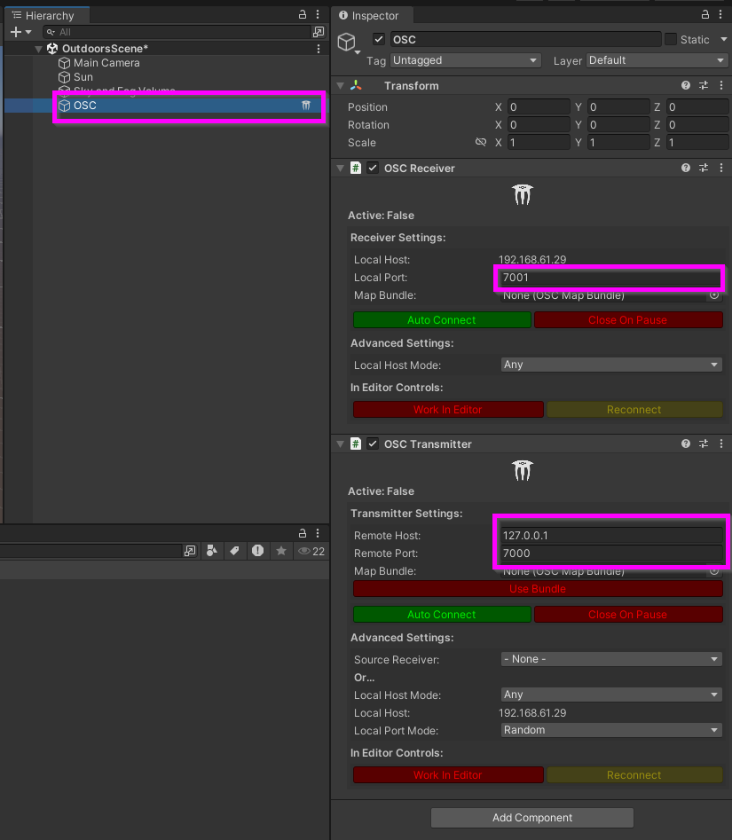

# Unity+extOSC : initialisation

## Préalables

* [Activer l’exécution en arrière-plan](/unity/execution_arriere-plan/)

## Installation de extOSC

Recherchez « extOSC » dans l’[Asset Store](https://assetstore.unity.com/) (assurez-vous d’être connecté à votre compte Unity avant) :  

Cliquez sur le bouton pour ajouter « extOSC » à vos *assets*, puis cliquez de nouveau pour ouvrir l’*asset* dans Unity :  

Téléchargez le paquet « extOSC » à partir du gestionnaire de paquets :  

Cliquez sur le bouton pour importer le paquet « extOSC » :  

Installez toutes les dépendances :  

Importez tous les *assets* :  

Vous devriez maintenant voir *extOSC* dans vos *assets* :  

## Intégration de l’objet de contrôle OSC

> [!Note]
> Effectuez les étapes suivantes une seule fois par scène.

* Créez un nouveau *GameObject* vide nommé `OSC`.
* Ajoutez-y les scripts (inclus avec *extOSC*) `OSCTransmitter` et `OSCReceiver`.
* Configurez ces deux scripts avec les paramètres réseau appropriés.

