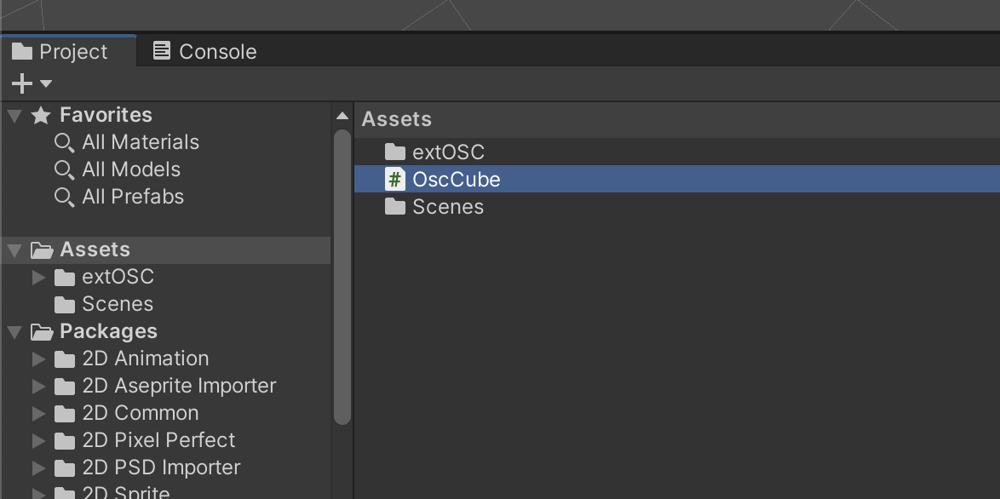

# Unity+extOSC : réception OSC

<!-- toc -->

## Préalable(s)

* Avoir suivi les instructions sur [l'initialisation d'extOSC](../initialisation/)

## Principe général de réception

La réception OSC dans Unity repose sur trois éléments :

- un **OSCReceiver** qui écoute les messages OSC entrants ;
- un **script de réception**
- une **adresse OSC** (par exemple `/angle`, `/position`, `/lumiere`) ;
- une **fonction de réception** appelée lorsqu’un message correspondant est reçu;
- traiter les messages reçus : [traitement de messages dans Unity](../../traitement/);
- ajouter le script de réception à un GameObject;
- lier l’OSCReceiver au script en glissant l’objet approprié.

**Chaque adresse OSC doit être associée à une fonction spécifique** qui sera chargée d’interpréter les données reçues et d’agir sur l’objet concerné.

### Préparation

Dans le script de réception, avant la définition de la classe, il faut ajouter :
```csharp
using extOSC;
```

Dans la classe, il faut référencer l’OSCReceiver :
```csharp
public OSCReceiver oscReceiver;
```

### Créer fonction de réception

Chaque adresse OSC devra être lié à sa propre fonction avec son propre nom selon le modèle suivant où `MA_FONCTION_RECEPTION` doit être renommé :
```csharp
void MA_FONCTION_RECEPTION(OSCMessage message)
{

}
```

### Nombre d'arguments

Dans cette fonction, on peut s'assurer que le nombre d'arguments correspond à un certain nombre en remplaçant `NOMBRE_ARGUMENTS` par le nombre attendu :
```csharp
if (message.Values.Count != NOMBRE_ARGUMENTS )
    {
        Debug.Log("Pas le bon nombre d'arguments");
        return; // retourner et ne pas exécuter le reste da la fonction
    }
```

### Types d'arguments

On peut aussi vérifier le type des arguments. 

Pour s'assurer qu'un argument est de type entier (`int`), remplacer `INDEX_ARGUMENT` par l'index de l'argument à vérifier :
```csharp
    if (message.Values[ INDEX_ARGUMENT ].Type != OSCValueType.Int)
    {
        Debug.Log("L'argument n'est pas un int");
        return;
    }
```

Pour s'assurer de la réception d'un nombre réel (`float`), remplacer `INDEX_ARGUMENT` par l'index de l'argument à vérifier :
```csharp
    int indexArgument = 0; 
    if (message.Values[ INDEX_ARGUMENT ].Type != OSCValueType.Float)
    {
        Debug.Log("L'argument n'est pas un float");
        return;
    }
```

### Récupérer la valeur des arguments

Finalement, utiliser ce code pour récupérer la valeur d'un `int` en remplaçant `INDEX_ARGUMENT` par l'index de l'argument :
```cpp
 int value = message.Values[ INDEX_ARGUMENT ].IntValue;
```
Ou pour un `float` :
```cpp
 float value = message.Values[ INDEX_ARGUMENT ].FloatValue;
```

### Lier la fonction de réception

Il faut ensuite associer les adresses OSC aux fonctions. Dans la méthode `Start()`, chaque adresse OSC doit être liée à sa fonction de réception grâce à `Bind()` :
```csharp
oscReceiver.Bind("/adresseOSC", MA_FONCTION_RECEPTION);
```
> [!NOTE]
> Il est important d'effectuer un `Bind()` avec une fonction distincte pour **chaque adresse OSC** à traiter.


## Exemple de réception d’un message OSC

Dans cet exemple, nous allons contrôler la rotation d’un Cube à partir de la valeur d’un message OSC `/angle`.

Pour chaque *GameObject* qui doit recevoir de l’OSC, créez un nouveau script (appelé `OscCube` dans cet exemple) :  


### Dans le script

Au tout début du script (après les autres `using`), ajoutez la ligne suivante pour utiliser le paquet **extOSC** :
```csharp
using extOSC;
```

Ensuite, dans la classe (avant les méthodes), déclarez une variable qui fera référence au script `OSCReceiver` :
```csharp
public extOSC.OSCReceiver oscReceiver;
```

Ajoutez également la méthode `Proportion()` (semblable à la fonction `scale` dans Max ou au `Math CHOP` dans TouchDesigner), utile pour adapter les échelles de valeurs :
```csharp
public static float Proportion(float value, float inputMin, float inputMax, float outputMin, float outputMax)
{
    return Mathf.Clamp(((value - inputMin) / (inputMax - inputMin) * (outputMax - outputMin) + outputMin), outputMin, outputMax);
}
```

Ajoutez ensuite la méthode `TraiterOscAngle()` qui sera appelée lorsqu’un message OSC (avec une adresse que nous définirons plus tard dans `Start()`) est reçu :
```csharp
void TraiterOscAngle(OSCMessage message)
{
// Si le message n'a pas d'argument ou l'argument n'est pas un Int on l'ignore
    if (message.Values.Count == 0)
    {
        Debug.Log("No value in OSC message");
        return;
    }
        
    if (message.Values[0].Type != OSCValueType.Int)
    {
        Debug.Log("Value in message is not an Int");
        return;
    }

    // Récupérer la valeur de l’angle depuis le message OSC
    int value = message.Values[0].IntValue;   
    
    // EXEMPLE : utiliser la valeur pour appliquer une rotation
    // Adapter proportionnellement la valeur reçue
    float angle = Proportion(value, 0, 4095, -180, 180);
    // Appliquer la rotation à l’objet
    transform.rotation = Quaternion.Euler(0, angle, 0);
}
```


Dans la méthode `Start()`, associer chaque adresse OSC à la fonction correspondante grâce à `Bind()`.  
Dans cet exemple, le message OSC `/angle` déclenche la fonction `TraiterOscAngle()` :
```csharp
oscReceiver.Bind("/angle", TraiterOscAngle);
```

> [!WARNING]
> Créer un `oscReceiver.Bind()` et une fonction différente de traitement de messages OSC (comme `TraiterOscAngle()`) pour **CHAQUE** adresse OSC qui doit être traitée

> [!NOTE]
> Pour les traitements de message, se référer à la section [Traitement de messages dans Unity](../../traitement/)


### Dans l’éditeur Unity

De retour dans l’éditeur Unity :
- Ajouter un *GameObject* (un Cube, dans cet exemple) à la scène.  
- Ajouter-lui le script `OscCube`.  
- Lier le `OSCReceiver` du GameObject `OSC` à la variable publique du script en glissant le GameObject `OSC` sur la variable correspondante dans l’inspecteur.


