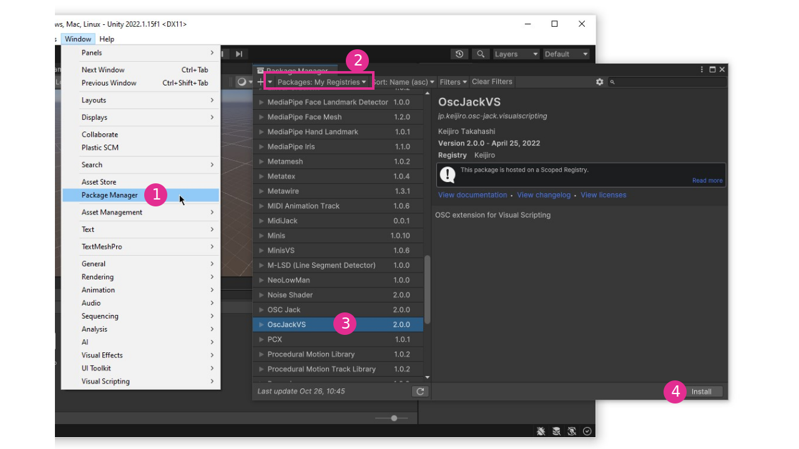
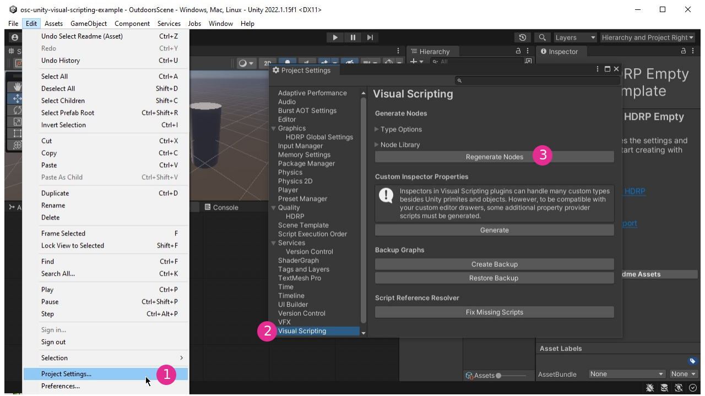
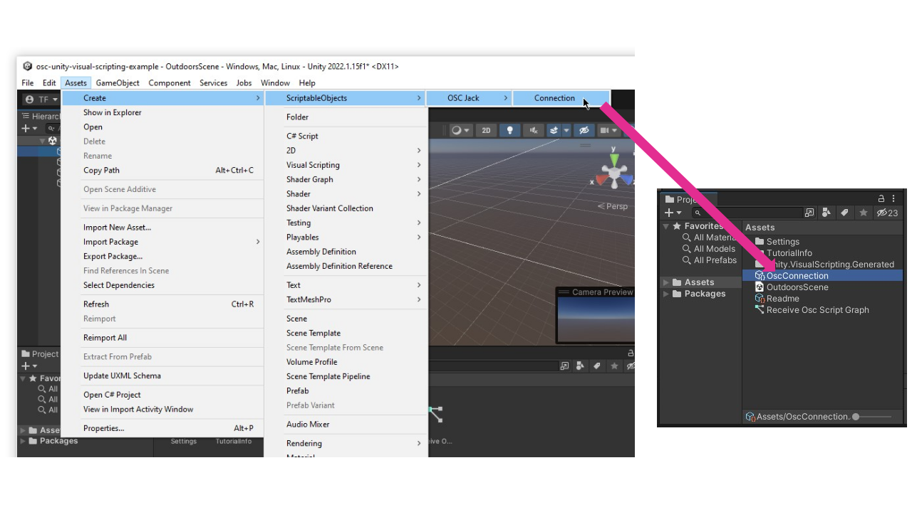
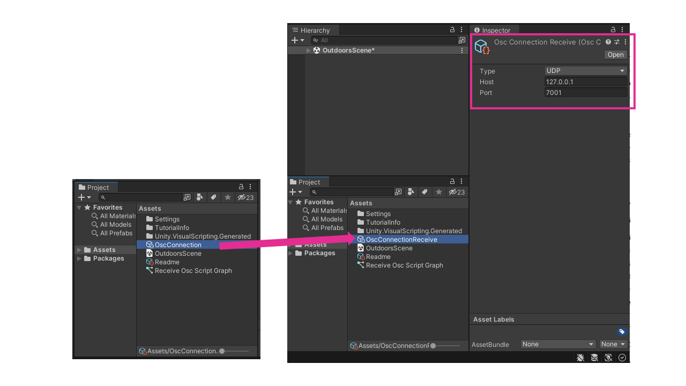
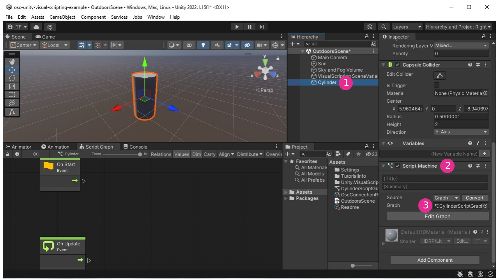
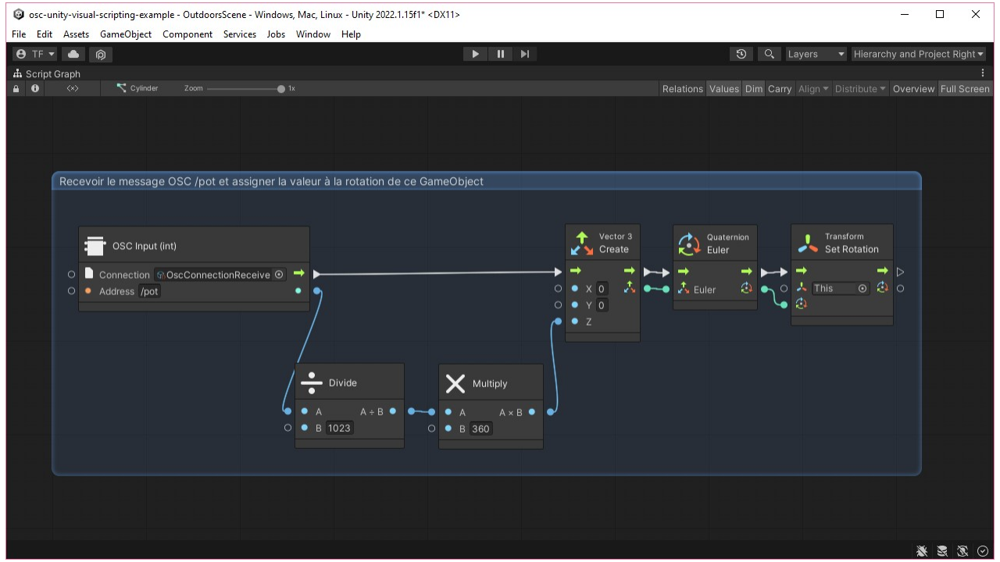

#  Unity : OSC UDP avec oscjackvs

Ce site documente deux paquets pour OSC UDP dans Unity  :
- **extOSC** si Visual Scripting n'est pas utilisé (plus commun) 
- **oscjackvs** si Visual Scripting est utilisé (moins commun)

Cette page présente **oscjackvs**.

## Préalables

* [Activer l'exécution en arrière-plan](/unity/execution_arriere-plan/)

## Intégration d'OSCJackVS

Nous utilisons [OSCJackVS](https://github.com/keijiro/OscJackVS) de Keijiro pour traiter les messages OSC UDP dans Unity.

Voici l'information à inscrire dans les paramètres du gestionnaire de paquets (voir figure ci-bas) :
* Name: `Keijiro`
* URL: `https://registry.npmjs.com`
* Scope: `jp.keijiro`

## Assignation du message /pot à la rotation d'un cylindre

