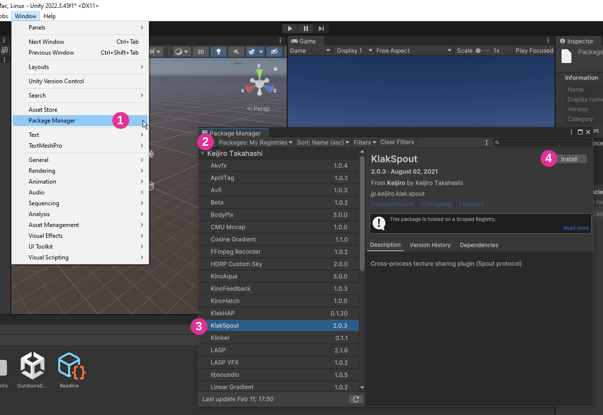
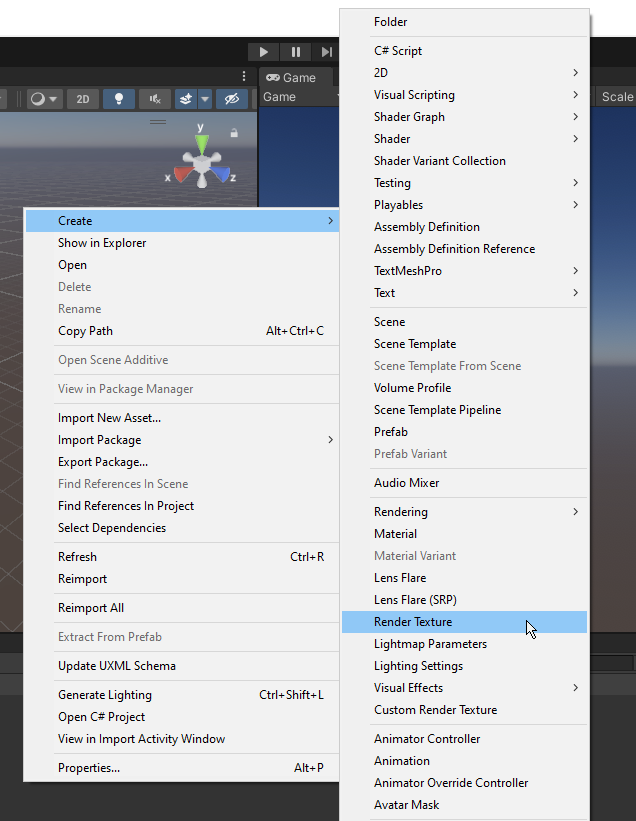
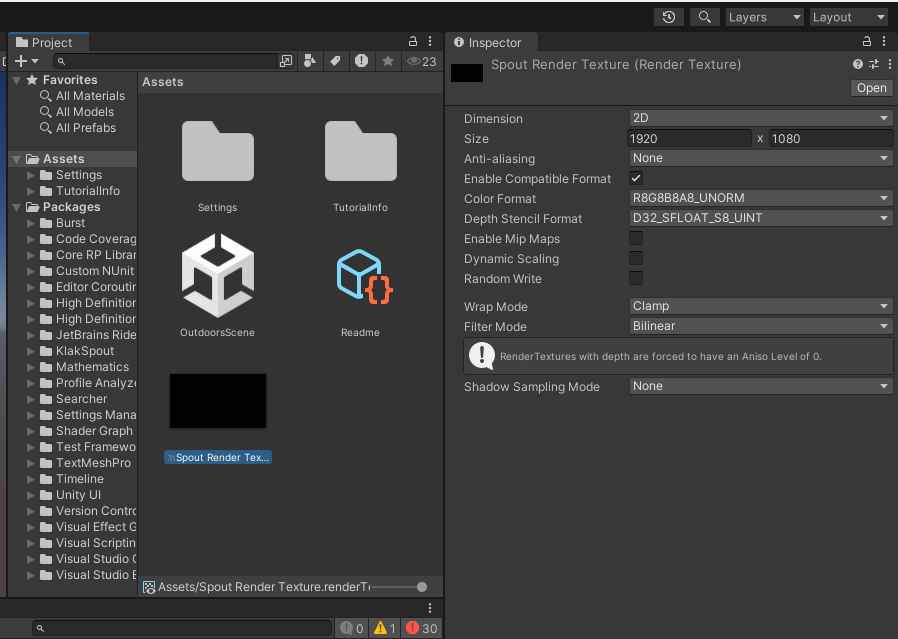
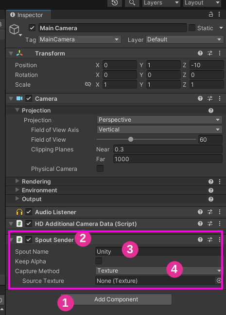
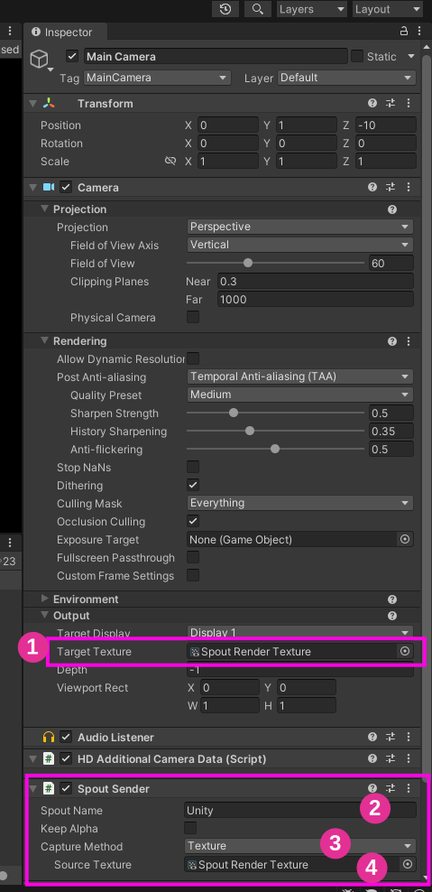
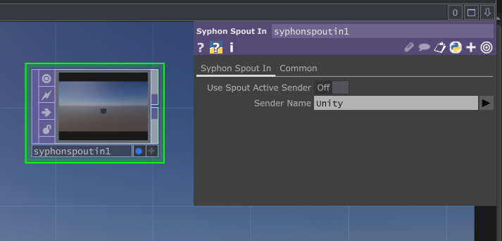

# Spout dans Unity

## Préalables

* [Activer l'exécution en arrière-plan](/unity/execution_arriere-plan/)

## Ajouter le régistre de Keijiro qui a créé KlakSpout dans Unity

Voici l'information à inscrire dans les paramètres du gestionnaire de paquets (voir figure ci-bas) :
* Name: `Keijiro`
* URL: `https://registry.npmjs.com`
* Scope: `jp.keijiro`

## Installer le paquet KlakSpout dans Unity

## Créer une nouvelle *Render Texture* dans les *Assets*

## Configurer la taille de la *Render Texture* et la renommer *Spout Render Texture*

## Ajouter le script *Spout Sender* à la caméra, nommer le Spout *Unity* et choisir le monde de capture *Texture*

## Configurer la caméra et *Spout Sender* 

> [!WARNING] 
> La caméra ne va plus effectuer de rendu dans la Game Window.

> [!NOTE] 
> Ajouter une deuxième caméra pour afficher le rendu dans la Game Window.

## Ajouter et configurer un *TOP Syphon Spout In* dans TouchDesigner

