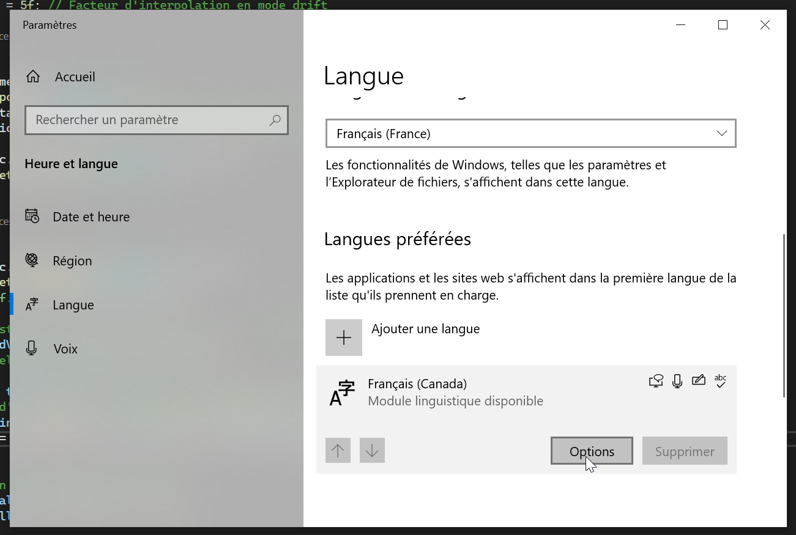

# Configurer son clavier dans Windows

## Configurer pour un clavier dont les touches sont en anglais

### Tableau des combinaisons pour les signes en français

Les signes en français peuvent être produits à l'aide de combinaisons de touches.   

| Lettre(s) accentuée(s) | Accent         | Description                                  | Exemple      |
|------------------------|----------------|----------------------------------------------|--------------|
| á, é                   | Accent aigu    | ' (apostrophe), puis la lettre (a, e, i, o, u)| 'a = á 'e = é |
| à, è                   | Accent grave   | \` (accent grave), puis la lettre (a, e, etc.)| \`a = à \`e = è |
| ê                      | Circonflexe    | Maj + 6 (^), puis e                          | ^e = ê       |
| ç                      | Cédille        | ' (apostrophe), puis c                       | 'c = ç       |
| ö                      | Tréma          | Maj + ' (apostrophe), puis o                 | "o = ö       |
| «, »                   | Guillemets     | Alt + [ ou ]                          | [ = « ] = » |

Veuillez noter que pour obtenir un apostrophe simple ou des guillemets anglais (simples ou doubles) sans accent, il suffit d'appuyer sur la touche correspondante, puis sur la barre d'espace.

| Signe         | Description    | Touches      |
|---------------|----------------|--------------|
| '            | apostrophe simple    | ' puis espace |
| "            | guillemets anglais  | " puis espace  |